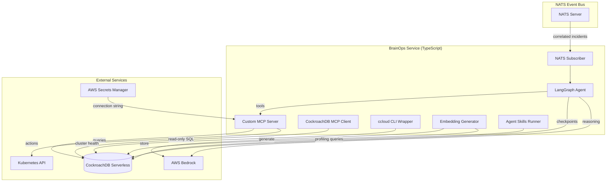

# Design Document: BrainOps Agent

## Overview

BrainOps is the TitanOps platform intelligence layer — a LangGraph.js agent (TypeScript) that uses CockroachDB as persistent memory. It subscribes to correlated incidents from NATS, reasons over historical data, orchestrates multi-step remediations, and learns from outcomes. It lives in the `titanops-core` repository under `brainops/`.

**Key Design Principles:**
- Memory-first: every decision is informed by historical data in CockroachDB
- Autonomous modules first: BrainOps enhances but never gates module actions
- Fail-safe: if BrainOps is down, modules still protect the cluster
- Auditable: every reasoning step and action is persisted

## Architecture

### High-Level Component Diagram



### Directory Structure

```
brainops/
├── src/
│   ├── index.ts                  # Entry point, startup orchestration
│   ├── agent/
│   │   ├── graph.ts              # LangGraph state graph definition
│   │   ├── state.ts              # Agent state type definitions
│   │   ├── nodes/
│   │   │   ├── receive.ts        # Receive incident from NATS
│   │   │   ├── search-memory.ts  # Vector similarity search
│   │   │   ├── reason.ts         # LLM reasoning with context
│   │   │   ├── act.ts            # Execute remediation
│   │   │   └── remember.ts       # Store resolution playbook
│   │   └── checkpointer.ts       # CockroachDB checkpointer setup
│   ├── mcp/
│   │   ├── server.ts             # Custom MCP server (tool definitions)
│   │   ├── tools/
│   │   │   ├── search-similar.ts
│   │   │   ├── query-history.ts
│   │   │   ├── get-playbook.ts
│   │   │   ├── execute-remediation.ts
│   │   │   ├── store-resolution.ts
│   │   │   └── get-node-history.ts
│   │   └── managed-mcp.ts        # CockroachDB Cloud MCP client
│   ├── nats/
│   │   ├── subscriber.ts         # NATS connection + subscription
│   │   └── types.ts              # Event type mappings
│   ├── db/
│   │   ├── client.ts             # CockroachDB connection pool
│   │   ├── migrations.ts         # Schema migration runner
│   │   └── queries/
│   │       ├── incidents.ts
│   │       ├── embeddings.ts
│   │       ├── resolutions.ts
│   │       └── audit.ts
│   ├── embeddings/
│   │   ├── generator.ts          # Bedrock Titan embedding generation
│   │   └── pipeline.ts           # Incident → embed → store flow
│   ├── safety/
│   │   ├── rate-limiter.ts       # 10 calls/min per tenant
│   │   ├── circuit-breaker.ts    # Pause after 3 failures
│   │   └── approval-gate.ts      # High-risk action approval
│   ├── self-optimization/
│   │   ├── scheduler.ts          # 6-hour cycle
│   │   ├── profiler.ts           # Statement fingerprint analysis
│   │   ├── range-analyzer.ts     # Range distribution check
│   │   └── schema-risk.ts        # Schema change risk evaluation
│   ├── ccloud/
│   │   └── client.ts             # ccloud CLI wrapper (JSON output)
│   ├── health/
│   │   └── endpoints.ts          # /healthz and /readyz
│   └── config/
│       └── index.ts              # Environment-based configuration
├── migrations/
│   └── 001_initial_schema.sql    # Full CockroachDB schema
├── Dockerfile
├── package.json
├── tsconfig.json
└── tests/
    ├── agent.test.ts
    ├── mcp-tools.test.ts
    └── safety.test.ts
```


## Component Interfaces

### Agent State

```typescript
// src/agent/state.ts
import { Annotation } from "@langchain/langgraph";

export const AgentState = Annotation.Root({
  // Current incident being processed
  incident: Annotation<CorrelatedIncident | null>,
  // Similar past incidents found via vector search
  similarIncidents: Annotation<SimilarIncident[]>,
  // Resolution playbook (if found)
  playbook: Annotation<ResolutionPlaybook | null>,
  // Agent's reasoning output
  reasoning: Annotation<ReasoningResult | null>,
  // Action to execute (or executed)
  action: Annotation<RemediationAction | null>,
  // Outcome of the action
  outcome: Annotation<ActionOutcome | null>,
  // Tenant context
  tenantId: Annotation<string>,
  // Current node in the graph
  currentStep: Annotation<string>,
});

export interface CorrelatedIncident {
  id: string;
  modules: string[];
  severity: number;
  narrative: string;
  confidenceScore: number;
  nodeId?: string;
  namespace?: string;
  podName?: string;
  contributingEvents: Record<string, unknown>[];
  createdAt: Date;
}

export interface SimilarIncident {
  incidentId: string;
  similarity: number; // 0-1 cosine similarity
  narrative: string;
  resolutionAction?: string;
  resolutionTimeMs?: number;
  modules: string[];
}

export interface ResolutionPlaybook {
  id: string;
  incidentId: string;
  actionSequence: RemediationAction[];
  success: boolean;
  durationMs: number;
  reuseCount: number;
}

export interface ReasoningResult {
  observation: string;
  analysis: string;
  selectedAction: string;
  alternatives: string[];
  confidence: number; // 0-1
  memoryContext: string; // What memory informed the decision
}

export interface RemediationAction {
  actionType: string; // pod_restart, node_cordon, cert_renew
  target: string;
  reason: string;
  riskLevel: "low" | "medium" | "high";
}

export interface ActionOutcome {
  success: boolean;
  durationMs: number;
  error?: string;
}
```

### MCP Tool Interfaces

```typescript
// src/mcp/tools/types.ts

export interface SearchSimilarInput {
  description: string;
  limit?: number;        // default 5
  minSimilarity?: number; // default 0.7
}

export interface QueryHistoryInput {
  nodeId?: string;
  namespace?: string;
  timeRangeDays: number; // default 30
  limit?: number;        // default 20
}

export interface GetPlaybookInput {
  incidentId: string;
}

export interface ExecuteRemediationInput {
  actionType: string;
  target: string;
  reason: string;
}

export interface StoreResolutionInput {
  incidentId: string;
  actions: RemediationAction[];
  success: boolean;
  durationMs: number;
}

export interface GetNodeHistoryInput {
  nodeId: string;
  days: number; // default 30
}
```

### Configuration

```typescript
// src/config/index.ts
export interface BrainOpsConfig {
  // CockroachDB
  cockroachdbUri: string;        // From Secrets Manager
  cockroachdbPoolSize: number;   // default 10

  // NATS
  natsUrl: string;               // nats://nats.titanops.svc:4222
  natsSubject: string;           // titanops.correlation.incidents.>

  // LLM
  bedrockRegion: string;         // us-east-2
  bedrockModelId: string;        // anthropic.claude-3-haiku-20240307
  embeddingModelId: string;      // amazon.titan-embed-text-v2:0

  // Safety
  rateLimitPerMinute: number;    // default 10
  circuitBreakerThreshold: number; // default 3
  circuitBreakerWindowMs: number;  // default 300000 (5 min)

  // Self-optimization
  selfOptimizationEnabled: boolean;
  selfOptimizationCron: string;  // default "0 */6 * * *"
  queryLatencyThresholdMs: number; // default 100

  // CockroachDB MCP
  managedMcpEndpoint: string;    // https://cockroachlabs.cloud/mcp
  managedMcpApiKey: string;      // From Secrets Manager

  // ccloud
  ccloudClusterId: string;
  ccloudServiceAccountKey: string;

  // General
  logLevel: string;              // default "info"
  tenantIdHeader: string;        // default "x-tenant-id"
}
```

## Data Flow

### Primary Flow: Incident → Memory → Action → Learn

```
1. Correlation Engine publishes correlated incident to NATS
     Subject: titanops.correlation.incidents.<tenant_id>

2. BrainOps NATS subscriber receives the incident
     → Deserializes protobuf
     → Extracts tenant_id
     → Triggers agent graph

3. Agent Node: receive_incident
     → Sets tenant_id on CockroachDB session (RLS)
     → Stores raw incident to ollinai.incidents
     → Generates embedding via Bedrock Titan
     → Stores embedding to ollinai.incident_embeddings
     → Checkpoint saved ✓

4. Agent Node: search_memory
     → Vector search: find similar past incidents (cosine > 0.7)
     → Query resolution playbooks for matches
     → Query node history if node_id present
     → Checkpoint saved ✓

5. Agent Node: reason
     → Send to LLM: incident + similar incidents + playbooks + history
     → LLM returns: reasoning chain + recommended action + confidence
     → Checkpoint saved ✓

6. Agent Node: act
     → If confidence < threshold → log only, skip action
     → If action is high-risk → write approval request, pause (interrupt)
     → If action is low-risk → verify cluster health (ccloud) → execute via K8s API
     → Write to audit_log
     → Checkpoint saved ✓

7. Agent Node: remember
     → Store resolution: what action, success/fail, duration
     → Update playbook reuse_count if reusing existing playbook
     → Checkpoint saved ✓ (complete)
```

### Secondary Flow: Self-Optimization (every 6 hours)

```
1. Scheduler triggers optimization cycle

2. Profile: query crdb_internal.statement_statistics for ollinai.* tables
     → Identify queries with mean latency > 100ms

3. Diagnose: SHOW RANGES for slow tables
     → Detect hotspots (>30% in one range)
     → Detect leaseholder imbalance

4. Evaluate: estimate schema change risk
     → Calculate storage impact
     → Assess available capacity

5. Act: recommend or execute fix
     → Low risk + small table → auto-execute + audit
     → Medium/critical → recommend to operator via dashboard
```

## Error Handling

| Error | Behavior | Recovery |
|-------|----------|---------|
| CockroachDB unreachable | Checkpoint save fails | Retry 3x with backoff (1s, 2s, 4s). If all fail, log warning, continue without checkpoint |
| NATS disconnection | No new incidents received | Auto-reconnect with backoff. Agent pauses reasoning until reconnected |
| Bedrock timeout (>10s) | LLM reasoning unavailable | Fall back to rule-based decision (if playbook exists with high reuse_count, apply it directly) |
| Embedding generation failure | Can't store vector | Skip embedding, store incident without vector. Log warning. Retry on next cycle |
| K8s action failure | Remediation didn't work | Write failure to audit_log. Increment circuit breaker counter. Alert operator |
| Circuit breaker trips | >3 failures in 5 min | Pause all autonomous actions for tenant. Alert operator. Require manual reset |
| Rate limit exceeded | >10 tool calls/min/tenant | Reject tool call with rate-limit error. Queue for next minute window |
| RLS violation | Tenant mismatch | Reject query. Log security event. Alert |

## Testing Strategy

### Unit Tests
- Agent state transitions (each node in isolation)
- MCP tool input validation
- Rate limiter behavior
- Circuit breaker state machine
- Embedding pipeline (mock Bedrock)

### Integration Tests
- Full agent flow with test CockroachDB (Docker)
- NATS publish → agent processes → CockroachDB writes
- Checkpoint save/restore across simulated restart
- Vector search accuracy with known embeddings

### End-to-End Tests
- Deploy to test EKS cluster
- Publish test incident → verify agent resolves it
- Kill pod mid-reasoning → verify checkpoint resume
- Trigger self-optimization with seeded slow queries

## Security Considerations

- Connection string from Secrets Manager (never env var in plaintext)
- IRSA for Bedrock + Secrets Manager (no static AWS keys)
- RLS enforced at connection level (`SET app.tenant_id` before every operation)
- Managed MCP is read-only (no write access via that path)
- ccloud service account is CLUSTER_READER only
- All tool invocations logged to audit_log with full context
