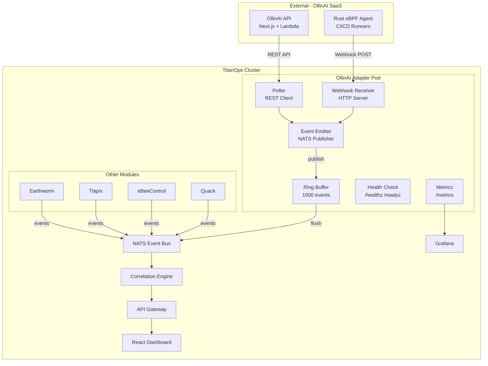

# Design Document: OllinAI Platform Integration

## Overview

This design integrates OllinAI (Change Intelligence & Deployment Risk) as a first-class module into the TitanOps autonomous AiOps platform. The integration introduces an **OllinAI_Adapter** Go module that bridges OllinAI's external SaaS outputs (TypeScript/AWS Lambda/DynamoDB) into TitanOps-compatible `export.Event` messages on the NATS event bus.

The adapter follows the same architectural patterns as existing modules (Earthworm, Tlapix, eBeeControl, Quack): it publishes typed events to NATS, the correlation engine matches them with other module signals within a sliding time window, and the results surface through the gateway API to the React dashboard and Grafana.

**Key Design Decisions:**

1. **Adapter as sidecar Deployment** — The adapter runs as its own Deployment (not embedded in existing binaries) to maintain module isolation and independent scaling.
2. **Polling + Webhook hybrid** — The adapter polls OllinAI's REST API for DORA metrics and deployment risk on a configurable interval, and accepts webhook pushes from OllinAI for real-time eBPF supply chain events.
3. **Shared library reuse** — Uses `titanops-export` for event emission/buffering and `titanops-config` for configuration loading/validation/hot-reload.
4. **Additive correlation scoring** — OllinAI's deployment risk score contributes an additive 0–20 bonus to the correlation engine's confidence formula without changing existing scoring logic.

## Architecture



### Data Flow

1. **Deployment Risk Flow**: OllinAI API → Poller (30s interval) → Deployment_Risk_Event → NATS → Correlation Engine
2. **DORA Metrics Flow**: OllinAI API → Poller (5m interval) → DORA_Metrics_Event → NATS → Correlation Engine
3. **eBPF Supply Chain Flow**: Rust eBPF Agent → Webhook POST → eBPF_Supply_Chain_Event → NATS → Correlation Engine
4. **Incident Correlation Flow**: OllinAI API → Poller → Incident_Correlation_Event → NATS → Correlation Engine

### Module Placement in Go Workspace

```
titanops/
├── modules/
│   └── ollinai/              # New Go module
│       ├── adapter.go        # Main adapter orchestration
│       ├── poller.go         # REST API polling loop
│       ├── webhook.go        # Webhook HTTP receiver
│       ├── emitter.go        # NATS event publishing
│       ├── events.go         # Event type definitions & builders
│       ├── config.go         # Configuration struct + validation
│       ├── health.go         # /healthz and /readyz handlers
│       ├── metrics.go        # Prometheus metric definitions
│       ├── severity.go       # Risk score → severity mapping
│       ├── payload.go        # JSON payload serialization + truncation
│       ├── go.mod
│       ├── go.sum
│       ├── adapter_test.go
│       ├── property_test.go  # Property-based tests (rapid)
│       └── emitter_test.go
├── go.work                   # Add ./modules/ollinai
└── ...
```

The `go.work` file will be updated to include `./modules/ollinai`.

## Components and Interfaces

### 1. OllinAI Adapter (Orchestrator)

```go
// Adapter is the top-level component that coordinates polling,
// webhook reception, event emission, and health reporting.
type Adapter struct {
    config      *atomic.Value  // holds *Config, atomic for hot-reload
    poller      *Poller
    webhook     *WebhookServer
    emitter     EventEmitter
    healthCheck *HealthChecker
    metrics     *Metrics
    stopCh      chan struct{}
}

// Run starts all sub-components and blocks until ctx is canceled or SIGTERM.
func (a *Adapter) Run(ctx context.Context) error
// Shutdown flushes buffers and stops all sub-components within 30s.
func (a *Adapter) Shutdown(ctx context.Context) error
```

### 2. EventEmitter Interface

```go
// EventEmitter publishes events to the NATS event bus with buffering and retry.
type EventEmitter interface {
    // Emit publishes an event. If NATS is unavailable, buffers locally.
    Emit(ctx context.Context, event export.Event) error
    // Flush drains all buffered events to NATS (used during shutdown).
    Flush(ctx context.Context) error
    // BufferLen returns current buffer occupancy.
    BufferLen() int
}
```

### 3. Poller

```go
// Poller periodically fetches data from the OllinAI REST API.
type Poller struct {
    client      *http.Client
    endpoint    string
    authToken   string
    riskInterval   time.Duration  // default 30s
    doraInterval   time.Duration  // default 5m
    emitter     EventEmitter
}

// Start begins polling loops for deployment risk and DORA metrics.
func (p *Poller) Start(ctx context.Context) error
```

### 4. WebhookServer

```go
// WebhookServer receives push notifications from OllinAI's eBPF agent.
type WebhookServer struct {
    server   *http.Server
    emitter  EventEmitter
    hmacKey  []byte  // HMAC-SHA256 signature verification
}

// Start begins listening for incoming webhook POSTs on the configured port.
func (ws *WebhookServer) Start(ctx context.Context) error
// Shutdown gracefully stops the HTTP server.
func (ws *WebhookServer) Shutdown(ctx context.Context) error
```

### 5. HealthChecker

```go
// HealthChecker tracks connection state for /healthz and /readyz endpoints.
type HealthChecker struct {
    natsConnected   atomic.Bool
    ollinConnected  atomic.Bool
}

func (hc *HealthChecker) Healthz(w http.ResponseWriter, r *http.Request)
func (hc *HealthChecker) Readyz(w http.ResponseWriter, r *http.Request)
```

### 6. Correlation Engine Extension

The existing `CalculateConfidence` function in `correlation/scoring.go` will be extended to accept an optional deployment risk bonus:

```go
// DeploymentRiskBonus normalizes an OllinAI risk score (0-100) to a 0-20 bonus.
func DeploymentRiskBonus(riskScore int) int {
    if riskScore < 0 {
        return 0
    }
    if riskScore > 100 {
        return 20
    }
    return riskScore / 5  // 0-100 → 0-20
}
```

The narrative generator in `correlation/narrative.go` will be extended to include deployment metadata (service name, commit SHA, deployer) when an OllinAI event is part of a correlated incident.

### 7. Dashboard Components

New React component: `OllinAIPanel.tsx`

```typescript
interface DeploymentRiskEntry {
  service: string;
  commit_sha: string;
  deployer: string;
  risk_score: number;
  risk_factors: string[];
  timestamp: string;
}

interface DORAMetrics {
  deployment_frequency: number;      // deploys per day
  lead_time_for_changes: number;     // hours
  change_failure_rate: number;       // 0.0-1.0
  mean_time_to_recovery: number;     // hours
  updated_at: string;
}
```

### 8. Gateway API Extensions

New endpoint: `GET /api/ollinai` — returns OllinAI-specific data for the dashboard panel.

```go
type OllinAIResponse struct {
    RecentDeployments []DeploymentRiskEntry `json:"recent_deployments"`
    DORAMetrics       *DORAMetrics          `json:"dora_metrics"`
}
```

## Data Models

### Event Types Published to NATS

All events use the existing `export.Event` struct. The following table defines the field mappings:

| Event Type | Module | EventType | Severity Mapping | Payload Contents |
|---|---|---|---|---|
| Deployment Risk | `"ollinai"` | `"deployment_risk"` | critical ≥80, high ≥60, medium ≥40, low <40 | `DeploymentRiskPayload` JSON |
| DORA Metrics | `"ollinai"` | `"dora_metrics"` | `"informational"` | `DORAMetricsPayload` JSON |
| Incident Correlation | `"ollinai"` | `"incident_correlation"` | `"high"` | `IncidentCorrelationPayload` JSON |
| Supply Chain - Credential Exfil | `"ollinai"` | `"supply_chain_credential_exfil"` | `"critical"` | `SupplyChainPayload` JSON |
| Supply Chain - Process Anomaly | `"ollinai"` | `"supply_chain_process_anomaly"` | `"high"` | `SupplyChainPayload` JSON |
| Supply Chain - Attestation Failure | `"ollinai"` | `"supply_chain_attestation_failure"` | `"high"` | `SupplyChainPayload` JSON |

### Payload Structs (serialized as JSON into `export.Event.Payload`)

```go
// DeploymentRiskPayload is the JSON payload for deployment_risk events.
type DeploymentRiskPayload struct {
    Service       string   `json:"service"`
    CommitSHA     string   `json:"commit_sha"`
    Deployer      string   `json:"deployer"`
    RiskScore     int      `json:"risk_score"`      // 0-100
    RiskFactors   []string `json:"risk_factors"`
    PipelineID    string   `json:"pipeline_id"`
    Environment   string   `json:"environment"`
}

// DORAMetricsPayload is the JSON payload for dora_metrics events.
type DORAMetricsPayload struct {
    DeploymentFrequency  float64 `json:"deployment_frequency"`   // deploys/day
    LeadTimeForChanges   float64 `json:"lead_time_for_changes"`  // hours
    ChangeFailureRate    float64 `json:"change_failure_rate"`     // 0.0-1.0
    TimeToRestoreService float64 `json:"time_to_restore_service"` // hours
}

// IncidentCorrelationPayload is the JSON payload for incident_correlation events.
type IncidentCorrelationPayload struct {
    DeploymentID string `json:"deployment_id"`
    IncidentID   string `json:"incident_id"`
    Service      string `json:"service"`
    Confidence   int    `json:"confidence"`  // 0-100
    Summary      string `json:"summary"`
}

// SupplyChainPayload is the JSON payload for supply chain eBPF events.
type SupplyChainPayload struct {
    PipelineID  string `json:"pipeline_id"`
    StepName    string `json:"step_name"`
    Repository  string `json:"repository"`
    Description string `json:"description"`
    Evidence    string `json:"evidence,omitempty"`
}
```

### Labels Convention

Events carry metadata in `export.Event.Labels`:

| Key | Description | Required |
|---|---|---|
| `"service"` | Target service name | Yes (deployment risk, incident correlation) |
| `"commit_sha"` | Git commit hash | Yes (deployment risk) |
| `"deployer"` | Deploying user/system | Yes (deployment risk) |
| `"pipeline_id"` | CI/CD pipeline identifier | Optional |
| `"step_name"` | Pipeline step name | Optional (supply chain) |
| `"repository"` | Source repository | Optional (supply chain) |
| `"metadata_incomplete"` | `"true"` when Node/Pod/Namespace missing | Conditional |
| `"payload_truncated"` | `"true"` when payload was truncated to 64KB | Conditional |

### Configuration Schema

```go
// Config holds all OllinAI adapter configuration.
type Config struct {
    // Endpoint is the OllinAI external API base URL (required).
    Endpoint string `yaml:"endpoint" validate:"required,url"`
    // AuthToken is the bearer token for OllinAI API authentication (required).
    AuthToken string `yaml:"authToken" validate:"required"`
    // WebhookPort is the port for receiving eBPF agent webhooks. Default: 8090.
    WebhookPort int `yaml:"webhookPort" validate:"min=1024,max=65535"`
    // WebhookHMACKey is the shared secret for webhook signature verification.
    WebhookHMACKey string `yaml:"webhookHmacKey"`
    // RiskPollInterval is the polling interval for deployment risk data. Default: 30s.
    RiskPollInterval time.Duration `yaml:"riskPollInterval" validate:"min=5s,max=300s"`
    // DORAPollInterval is the polling interval for DORA metrics. Default: 5m.
    DORAPollInterval time.Duration `yaml:"doraPollInterval" validate:"min=30s,max=30m"`
    // NATSUrl is the NATS server URL. Default: nats://titanops-nats:4222.
    NATSUrl string `yaml:"natsUrl" validate:"required,url"`
    // BufferCapacity is the ring buffer size for event buffering. Default: 1000.
    BufferCapacity int `yaml:"bufferCapacity" validate:"min=100,max=10000"`
    // MaxPayloadBytes is the maximum JSON payload size. Default: 65536 (64KB).
    MaxPayloadBytes int `yaml:"maxPayloadBytes" validate:"min=1024,max=65536"`
    // MetricsPort is the Prometheus metrics endpoint port. Default: 9090.
    MetricsPort int `yaml:"metricsPort" validate:"min=1024,max=65535"`
}
```

### Prometheus Metrics

| Metric Name | Type | Description |
|---|---|---|
| `titanops_ollinai_deployment_risk_score_current` | Gauge | Latest deployment risk score per service |
| `titanops_ollinai_deployments_total` | Counter | Total deployments observed |
| `titanops_ollinai_change_failure_rate_ratio` | Gauge | Current DORA change failure rate |
| `titanops_ollinai_lead_time_hours` | Gauge | Current DORA lead time for changes |
| `titanops_ollinai_deployment_frequency_per_day` | Gauge | Current DORA deployment frequency |
| `titanops_ollinai_mttr_hours` | Gauge | Current DORA mean time to recovery |
| `titanops_ollinai_supply_chain_events_total` | Counter | Total supply chain security events by type |
| `titanops_ollinai_events_emitted_total` | Counter | Total events published to NATS |
| `titanops_ollinai_events_buffered_current` | Gauge | Events currently in ring buffer |
| `titanops_ollinai_events_dropped_total` | Counter | Events dropped due to buffer overflow or retry exhaustion |
| `titanops_ollinai_poll_errors_total` | Counter | API polling errors |
| `titanops_ollinai_poll_duration_seconds` | Histogram | API polling latency |

### Helm Chart Values (addition to `values.yaml`)

```yaml
# OllinAI Change Intelligence integration
ollinai:
  enabled: false
  replicas: 1
  image:
    repository: titanops/ollinai-adapter
    tag: "0.1.0"
    pullPolicy: IfNotPresent
  endpoint: ""          # Required when enabled: OllinAI API URL
  authToken: ""         # Required when enabled: reference to K8s Secret
  webhookPort: 8090
  webhookHmacKey: ""
  riskPollInterval: 30s
  doraPollInterval: 5m
  natsUrl: "nats://{{ .Release.Name }}-nats:4222"
  bufferCapacity: 1000
  maxPayloadBytes: 65536
  metricsPort: 9090
  resources:
    requests:
      cpu: 100m
      memory: 128Mi
    limits:
      cpu: 500m
      memory: 256Mi
```

### Grafana Dashboard Structure

The `grafana/ollinai-dashboard.json` file follows the same structure as `earthworm-dashboard.json`:

- **Datasource input**: `DS_PROMETHEUS`
- **Requires**: Grafana ≥9.0.0, Prometheus datasource, `stat`, `timeseries`, `bargauge`, `table` panel types
- **Tags**: `["titanops", "ollinai"]`
- **UID**: `titanops-ollinai`
- **Panels**:
  1. **Deployment Risk Score (timeseries)** — `titanops_ollinai_deployment_risk_score_current` over time, thresholds at 60 (high) and 80 (critical)
  2. **Deployment Frequency (stat)** — `titanops_ollinai_deployment_frequency_per_day`
  3. **Lead Time for Changes (stat)** — `titanops_ollinai_lead_time_hours`
  4. **Change Failure Rate (stat)** — `titanops_ollinai_change_failure_rate_ratio` as percentage
  5. **Mean Time to Recovery (stat)** — `titanops_ollinai_mttr_hours`
  6. **Risk Score Distribution (histogram)** — `histogram_quantile` over risk score buckets
  7. **High-Risk Deployments Table** — `titanops_ollinai_deployment_risk_score_current >= 70` last 24h
  8. **Supply Chain Events (timeseries)** — `titanops_ollinai_supply_chain_events_total` by type
  9. **Adapter Health (stat)** — events emitted, buffered, dropped


## Correctness Properties

*A property is a characteristic or behavior that should hold true across all valid executions of a system — essentially, a formal statement about what the system should do. Properties serve as the bridge between human-readable specifications and machine-verifiable correctness guarantees.*

### Property 1: Severity mapping from risk score

*For any* deployment risk score in the range [0, 100], the severity field of the emitted Deployment_Risk_Event SHALL be "critical" if score ≥ 80, "high" if score ≥ 60, "medium" if score ≥ 40, and "low" if score < 40. Additionally, Module SHALL always be "ollinai" and EventType SHALL always be "deployment_risk".

**Validates: Requirements 1.1**

### Property 2: DORA metrics payload completeness

*For any* set of DORA metric values (deployment_frequency, lead_time_for_changes, change_failure_rate, time_to_restore_service), the serialized JSON Payload of the emitted DORA_Metrics_Event SHALL deserialize to a map containing all four required keys with values matching the inputs.

**Validates: Requirements 1.2**

### Property 3: Event metadata population and incomplete label

*For any* combination of Node, Pod, and Namespace values (each either a non-empty string or empty/missing), the emitted export.Event SHALL carry the provided values in their respective fields, set missing fields to empty string, and include the label `"metadata_incomplete"="true"` if and only if at least one of Node, Pod, or Namespace is empty.

**Validates: Requirements 1.4, 1.5**

### Property 4: EventID uniqueness

*For any* sequence of N events generated by the OllinAI_Adapter, all N EventID values SHALL be distinct valid UUID v4 strings and all Timestamp values SHALL be valid RFC 3339 timestamps in UTC.

**Validates: Requirements 1.6, 5.4**

### Property 5: Payload serialization and truncation

*For any* valid payload struct, the serialized JSON in the Payload field SHALL be valid JSON with size ≤ 64 KB. If the original serialization exceeds 64 KB, the truncated result SHALL preserve all required summary fields and the event SHALL carry the label `"payload_truncated"="true"`.

**Validates: Requirements 1.7, 1.8**

### Property 6: Ring buffer capacity invariant

*For any* sequence of events pushed to the ring buffer (capacity 1000), the buffer length SHALL never exceed 1000. When the buffer is full and a new event is pushed, the oldest event SHALL be evicted first.

**Validates: Requirements 1.9, 5.3**

### Property 7: Cross-module correlation matching

*For any* pair of an OllinAI event (Deployment_Risk_Event or eBPF_Supply_Chain_Event) and an event from another module (Earthworm, Tlapix, eBeeControl, Quack), the Correlation_Engine SHALL generate a CorrelatedIncident if and only if the events share at least one matching attribute (Node, Pod, or Namespace — per module-specific rules) AND both events fall within the configured correlation time window.

**Validates: Requirements 2.1, 2.2, 2.3, 2.4, 7.6**

### Property 8: Deployment risk bonus scoring

*For any* risk score R in [0, 100] and any base confidence score B in [0, 100], the deployment risk bonus SHALL equal floor(R / 5) (yielding a value in [0, 20]), and the total confidence score SHALL equal min(B + floor(R / 5), 100).

**Validates: Requirements 2.5**

### Property 9: Narrative metadata inclusion

*For any* CorrelatedIncident that includes an OllinAI Deployment_Risk_Event, the generated narrative SHALL contain the values of the "service", "commit_sha", and "deployer" Labels that are present and non-empty on the event, and SHALL omit (not produce placeholder text for) any of those Labels that are missing or empty.

**Validates: Requirements 2.6, 2.8**

### Property 10: Single-module non-correlation

*For any* OllinAI event ingested by the Correlation_Engine where no event from a different module shares matching attributes within the time window, the engine SHALL NOT generate a CorrelatedIncident.

**Validates: Requirements 2.7**

### Property 11: Configuration validation rejects invalid configs

*For any* Config struct where at least one field violates its validation constraint (e.g., Endpoint empty, WebhookPort outside [1024, 65535], RiskPollInterval outside [5s, 300s]), the validation function SHALL return one or more errors identifying the invalid field names and constraint violations, and the adapter SHALL not apply the invalid configuration.

**Validates: Requirements 6.2, 6.4**

### Property 12: Readyz reflects connection state

*For any* combination of NATS connection state (connected/disconnected) and OllinAI connection state (connected/disconnected), the `/readyz` endpoint SHALL return HTTP 200 if and only if both connections are active, and HTTP 503 otherwise.

**Validates: Requirements 8.2, 8.3, 8.4**

## Error Handling

### Error Categories

Following the TitanOps engineering standards for typed errors:

```go
type ErrorCategory string

const (
    ErrOllinAPIUnavailable  ErrorCategory = "ollinai_api_unavailable"
    ErrOllinAPITimeout      ErrorCategory = "ollinai_api_timeout"
    ErrOllinAPIAuth         ErrorCategory = "ollinai_auth_failed"
    ErrNATSUnavailable      ErrorCategory = "nats_unavailable"
    ErrPayloadTooLarge      ErrorCategory = "payload_too_large"
    ErrPayloadInvalid       ErrorCategory = "payload_invalid"
    ErrConfigInvalid        ErrorCategory = "config_invalid"
    ErrWebhookSignature     ErrorCategory = "webhook_signature_invalid"
)

type AdapterError struct {
    Category ErrorCategory
    Message  string
    Cause    error
    Module   string  // always "ollinai"
}
```

### Error Handling Strategies

| Error Scenario | Strategy | Impact |
|---|---|---|
| OllinAI API unavailable | Log warning, set readyz=503, continue buffering, retry on next poll | Events buffered locally, no data loss up to buffer capacity |
| OllinAI API auth failure | Log error, set readyz=503, do not retry until config change | Adapter non-functional until auth fixed |
| OllinAI API timeout | Log warning, increment `poll_errors_total`, retry on next interval | Transient, self-recovering |
| NATS unavailable | Log warning, set readyz=503, buffer events (ring buffer 1000), exponential backoff retry | Oldest events evicted if buffer fills |
| Payload exceeds 64KB | Truncate, set `payload_truncated` label, log info | Partial data delivered, no failure |
| Invalid webhook signature | Return HTTP 401, log warning with source IP | Event rejected, no processing |
| Config validation failure (startup) | Log all errors with field/value/constraint, exit non-zero | Pod fails readiness, Kubernetes restarts |
| Config validation failure (hot-reload) | Log warning, keep previous valid config | No disruption to operation |
| Export backend failure | Per-backend ring buffer + retry, log after max retries | One backend failure doesn't affect others |

### Graceful Shutdown Sequence

```
SIGTERM received
  → Stop accepting new webhook requests (server.Shutdown)
  → Stop polling loops (cancel poller context)
  → Flush NATS buffer (drain ring buffer → NATS publish)
  → If flush exceeds 30s deadline: terminate, discard remaining
  → Close NATS connection
  → Exit 0
```

## Testing Strategy

### Property-Based Testing

**Library:** `pgregory.net/rapid` (same as existing TitanOps modules)

**Configuration:** Minimum 100 iterations per property test.

**Tag format:** `// Feature: ollinai-platform-integration, Property N: <title>`

Properties 1–12 defined above will each be implemented as a single property-based test using `rapid.Check`. Key generators:

- **Risk score generator**: `rapid.IntRange(0, 100)`
- **Event metadata generator**: `rapid.OneOf(rapid.Just(""), rapid.StringMatching("[a-z0-9-]{1,63}"))`
- **DORA metrics generator**: `rapid.Float64Range(0, 1000)` for each metric
- **Payload size generator**: `rapid.SliceOfN(rapid.Byte(), 0, 100000)` for testing truncation
- **Time window generator**: `rapid.IntRange(10, 600)` seconds
- **Config generator**: struct with fields drawn from valid and invalid ranges

### Unit Tests (Example-Based)

- Helm chart event type mappings (7.1, 7.2, 7.3): verify specific event type strings
- Dashboard component rendering (4.1–4.7): React Testing Library
- Grafana JSON structure (9.1–9.5): JSON schema validation
- Webhook HMAC signature verification
- Graceful shutdown timing (8.5, 8.6): time-bounded tests with mocked NATS

### Integration Tests

- `//go:build integration` tag
- NATS publish/subscribe round-trip with real NATS (testcontainers)
- Correlation engine ingestion of OllinAI events alongside other module events
- Config hot-reload with file system watcher
- Full adapter lifecycle: start → poll → emit → shutdown

### Helm Tests

- `helm test` pod: verify NATS connectivity + OllinAI API reachability
- `helm lint`: validate chart syntax
- Template rendering: verify conditional resources with `--set ollinai.enabled=true/false`

### Dashboard Tests

- Vitest + React Testing Library for OllinAIPanel component
- Mock API responses for deployment risk, DORA metrics, and error states
- Accessibility: verify ARIA labels and keyboard navigation
- Polling interval verification with fake timers
