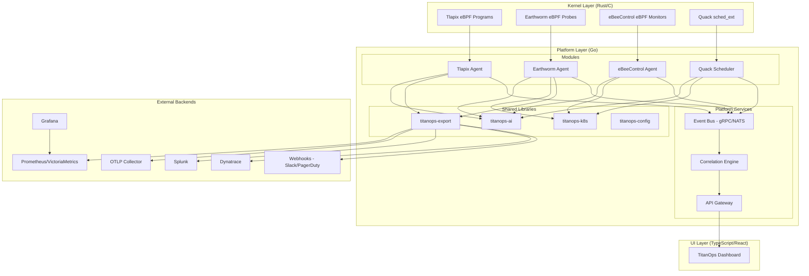
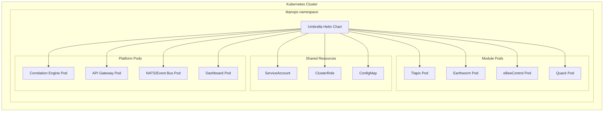

# Design Document: TitanOps Platform Integration

## Overview

TitanOps Platform Integration unifies four autonomous AiOps modules (Earthworm, Tlapix, eBeeControl, Quack) into a cohesive Kubernetes-native platform. The integration layer provides shared infrastructure for installation, observability export, cross-module correlation, AI inference, and a unified management interface — without replacing existing observability stacks.

The platform follows a hybrid multi-repo strategy with a central `titanops/` repository housing shared Go libraries, the correlation engine, API gateway, React dashboard, and umbrella Helm chart. Each module remains independently installable while gaining platform-level capabilities when deployed together.

**Key Design Principles:**
- Local-first AI: ONNX inference with zero cloud dependencies by default
- Vendor-neutral exports: Prometheus, OTLP, Splunk HEC, Dynatrace, webhooks — customer picks their backend
- Independent-first: Each module works standalone; platform features are additive
- One-way dependencies: Modules import shared libraries; shared libraries never import modules
- Kernel-speed actions: Inference, decisions, and actions never depend on network round-trips

## Architecture

### High-Level Architecture



### Deployment Architecture



### Data Flow Architecture

The platform uses a publish-subscribe event model:

1. **Event Emission**: Each module emits structured events (protobuf) to the shared event bus
2. **Correlation**: The correlation engine subscribes to all module events, performs time-window matching
3. **Export**: The export adapter layer fans out telemetry to all configured backends concurrently
4. **Dashboard**: The API gateway aggregates state from modules and correlation engine for the React UI

## Components and Interfaces

### 1. Shared Go Libraries

#### titanops-ai

```go
package ai

// Provider defines the unified AI interface all backends implement.
type Provider interface {
    // Predict runs local ONNX inference. Never calls cloud.
    Predict(ctx context.Context, req PredictRequest) (PredictResponse, error)
    // Train delegates to cloud backend (optional). No-op for local provider.
    Train(ctx context.Context, req TrainRequest) (TrainResponse, error)
    // Explain generates human-readable reasoning (optional cloud).
    Explain(ctx context.Context, req ExplainRequest) (ExplainResponse, error)
}

type PredictRequest struct {
    ModuleID string
    Features []float32
}

type PredictResponse struct {
    Score      float64
    Confidence float64
    Labels     map[string]float64
}

type TrainRequest struct {
    ModuleID string
    Data     [][]float32
    Labels   []string
}

type TrainResponse struct {
    ModelPath string
    Metrics   map[string]float64
}

type ExplainRequest struct {
    ModuleID   string
    Decision   PredictResponse
    Context    map[string]string
}

type ExplainResponse struct {
    Reasoning string
    Factors   []ExplainFactor
}

type ExplainFactor struct {
    Name       string
    Weight     float64
    Direction  string // "positive" or "negative"
}

// LocalProvider implements Provider using ONNX Runtime.
type LocalProvider struct {
    modelDir string
    models   map[string]*ONNXSession
}

// NewLocalProvider creates a provider that loads ONNX models from modelDir.
// Each module's model is expected at: {modelDir}/{moduleID}-anomaly.onnx
func NewLocalProvider(modelDir string) (*LocalProvider, error)

// CloudProvider wraps a cloud backend with local fallback.
type CloudProvider struct {
    local    *LocalProvider
    backend  CloudBackend
    timeout  time.Duration // default 5s
}

// CloudBackend is implemented by each cloud provider adapter.
type CloudBackend interface {
    Train(ctx context.Context, req TrainRequest) (TrainResponse, error)
    Explain(ctx context.Context, req ExplainRequest) (ExplainResponse, error)
}
```

#### titanops-k8s

```go
package k8s

import (
    "context"
    metav1 "k8s.io/apimachinery/pkg/apis/meta/v1"
    corev1 "k8s.io/api/core/v1"
)

// Client provides common Kubernetes operations used across modules.
type Client interface {
    // ReadSecret retrieves a secret value by name and namespace.
    ReadSecret(ctx context.Context, namespace, name, key string) ([]byte, error)
    // ListPods returns pods matching the given label selector in a namespace.
    ListPods(ctx context.Context, namespace string, selector map[string]string) ([]corev1.Pod, error)
    // DeletePod removes a pod by name and namespace.
    DeletePod(ctx context.Context, namespace, name string) error
    // CordonNode marks a node as unschedulable.
    CordonNode(ctx context.Context, nodeName string) error
    // RestartPod deletes a pod to trigger restart by its controller.
    RestartPod(ctx context.Context, namespace, name string) error
}
```

#### titanops-export

```go
package export

import "context"

// Config defines the unified export configuration.
type Config struct {
    Prometheus *PrometheusConfig
    OTLP       *OTLPConfig
    Splunk     *SplunkConfig
    Dynatrace  *DynatraceConfig
    Webhooks   []WebhookConfig
}

type PrometheusConfig struct {
    Enabled bool
    Port    int // default 9090, range 1024-65535
}

type OTLPConfig struct {
    Enabled  bool
    Endpoint string
}

type SplunkConfig struct {
    Enabled  bool
    HECUrl   string
    HECToken string
}

type DynatraceConfig struct {
    Enabled  bool
    APIUrl   string
    APIToken string
}

type WebhookConfig struct {
    Endpoint   string
    Events     []string // severity filter: critical, high, medium, low
    TimeoutSec int      // default 10, max 10
    MaxRetries int      // default 3
}

// Exporter manages concurrent export to all configured backends.
type Exporter interface {
    // Export sends an event to all enabled backends concurrently.
    // Failure in one backend does not block others.
    Export(ctx context.Context, event Event) []ExportResult
    // BufferStatus returns current buffer utilization per backend.
    BufferStatus() map[string]BufferInfo
}

type BufferInfo struct {
    Capacity int // max 1000
    Used     int
    Dropped  int
}

type ExportResult struct {
    Backend string
    Success bool
    Error   error
}
```

#### titanops-config

```go
package config

// Load reads configuration from Helm values (env vars), file sources,
// and merges them into the target struct. Returns field-level validation errors.
func Load(target interface{}, opts ...Option) ([]ValidationError, error)

type ValidationError struct {
    Field   string
    Value   interface{}
    Message string
}

type Option func(*loader)

func WithEnvPrefix(prefix string) Option
func WithFile(path string) Option
func WithDefaults(defaults interface{}) Option
```

### 2. Event Schema (Protobuf)

```protobuf
syntax = "proto3";
package titanops.events.v1;

import "google/protobuf/timestamp.proto";

enum Severity {
    SEVERITY_UNSPECIFIED = 0;
    SEVERITY_INFORMATIONAL = 1;
    SEVERITY_LOW = 2;
    SEVERITY_MEDIUM = 3;
    SEVERITY_HIGH = 4;
    SEVERITY_CRITICAL = 5;
}

enum Module {
    MODULE_UNSPECIFIED = 0;
    MODULE_TLAPIX = 1;
    MODULE_EARTHWORM = 2;
    MODULE_EBEECONTROL = 3;
    MODULE_QUACK = 4;
    MODULE_CORRELATION = 5;
}

message Event {
    // Required fields
    string namespace = 1;
    google.protobuf.Timestamp timestamp = 2;
    Severity severity = 3;
    Module module = 4;
    string event_type = 5;
    bytes payload = 6; // max 64KB

    // Optional fields
    optional string node = 7;
    optional string pod = 8;

    // Metadata
    string event_id = 9;
    map<string, string> labels = 10;
}

message CorrelatedIncident {
    string incident_id = 1;
    repeated Event contributing_events = 2;
    double confidence_score = 3; // 0-100
    string narrative = 4;
    repeated string matched_attributes = 5;
    google.protobuf.Timestamp detected_at = 6;
    AutoAction recommended_action = 7;
}

message AutoAction {
    string action_type = 1; // isolate_pod, alert_operator, forensic_report
    map<string, string> parameters = 2;
    string reason = 3;
}
```

### 3. Correlation Engine

```go
package correlation

import "time"

// Engine processes events from the event bus and generates correlated incidents.
type Engine interface {
    // Start begins consuming events from the event bus.
    Start(ctx context.Context) error
    // Stop gracefully shuts down the engine.
    Stop(ctx context.Context) error
    // GetIncidents returns recent correlated incidents.
    GetIncidents(ctx context.Context, filter IncidentFilter) ([]CorrelatedIncident, error)
}

type EngineConfig struct {
    TimeWindow          time.Duration // default 120s, range 10-600s
    ConfidenceThreshold int           // default 80, range 1-100
    AutoActions         []AutoActionConfig
}

type AutoActionConfig struct {
    Type       string // isolate_pod, alert_operator, forensic_report
    Enabled    bool
    Parameters map[string]string
}

type IncidentFilter struct {
    Since        time.Time
    MinConfidence int
    Modules      []string
}

// CorrelationRule defines how events are matched across modules.
type CorrelationRule struct {
    Name            string
    RequiredModules int    // minimum distinct modules (default: 2)
    MatchAttributes []string // fields to match: node, pod, namespace
    TimeWindow      time.Duration
    ScoreWeights    map[string]float64
}
```

### 4. API Gateway

```go
package gateway

// Gateway serves the Dashboard and exposes platform state via REST/gRPC.
type Gateway interface {
    // Module health
    GetModuleHealth(ctx context.Context) ([]ModuleHealth, error)
    // Autonomous actions
    GetRecentActions(ctx context.Context, limit int, since time.Time) ([]AutonomousAction, error)
    // Correlation
    GetCorrelationTimeline(ctx context.Context, window time.Duration) ([]CorrelatedIncident, error)
    // Override controls
    ApproveAction(ctx context.Context, actionID string, operatorID string) error
    RejectAction(ctx context.Context, actionID string, operatorID string) error
    PauseModule(ctx context.Context, moduleID string, operatorID string) error
    ResumeModule(ctx context.Context, moduleID string, operatorID string) error
    // Audit
    GetAuditTrail(ctx context.Context, filter AuditFilter) ([]AuditEntry, error)
}

type ModuleHealth struct {
    Module string
    Status string // operational, degraded, unavailable
    Since  time.Time
}

type AutonomousAction struct {
    ID          string
    Module      string
    ActionType  string
    Trigger     Event
    Confidence  float64
    Reasoning   ReasoningChain
    Outcome     string
    Timestamp   time.Time
    OverrideBy  string // operator ID if overridden
}

type ReasoningChain struct {
    Observation string
    Analysis    string
    Action      string
    Alternatives []string
}

type AuditEntry struct {
    Timestamp   time.Time
    Module      string
    ActionType  string
    TriggerEvent string
    Confidence  float64
    Reasoning   string
    Outcome     string
    OperatorID  string
}
```

### 5. Umbrella Helm Chart Structure

```
helm/titanops/
├── Chart.yaml                    # Umbrella chart with dependency declarations
├── values.yaml                   # Global + per-module config
├── charts/
│   ├── tlapix/                   # Sub-chart dependency
│   ├── earthworm/                # Sub-chart dependency
│   ├── ebeecontrol/              # Sub-chart dependency
│   └── quack/                    # Sub-chart dependency
├── templates/
│   ├── shared-rbac.yaml          # Unified ServiceAccount + ClusterRole
│   ├── shared-configmap.yaml     # Common config (cluster name, OTLP endpoint)
│   ├── correlation-deployment.yaml
│   ├── gateway-deployment.yaml
│   ├── event-bus-deployment.yaml
│   └── dashboard-deployment.yaml
└── grafana/
    ├── overview-dashboard.json
    └── correlation-dashboard.json
```

### 6. Dashboard (React)

The TitanOps Dashboard is a React application served by the API Gateway. Key views:

| View | Purpose | Data Source |
|------|---------|-------------|
| Module Health | Status indicators for all 4 modules | Gateway `/api/health` |
| Actions Feed | Recent autonomous actions with reasoning chains | Gateway `/api/actions` |
| Correlation Timeline | Cross-module events grouped by incident | Gateway `/api/correlations` |
| Override Controls | Approve/reject/pause pending actions | Gateway `/api/overrides` |
| Audit Trail | Historical record of all actions and overrides | Gateway `/api/audit` |
| Explainability | "Why did TitanOps do X?" detail view | Gateway `/api/explain/{actionID}` |

## Data Models

### Event Schema Fields

| Field | Type | Required | Constraints |
|-------|------|----------|-------------|
| namespace | string | Yes | Non-empty Kubernetes namespace |
| timestamp | Timestamp | Yes | UTC, RFC 3339, millisecond precision |
| severity | enum | Yes | critical, high, medium, low, informational |
| module | enum | Yes | tlapix, earthworm, ebeecontrol, quack, correlation |
| event_type | string | Yes | Module-specific event type identifier |
| payload | bytes | Yes | Max 64 KB |
| node | string | No | Kubernetes node name |
| pod | string | No | Kubernetes pod name |
| event_id | string | Yes | UUID v4 |
| labels | map | No | Arbitrary key-value metadata |

### Correlated Incident

| Field | Type | Constraints |
|-------|------|-------------|
| incident_id | string | UUID v4 |
| contributing_events | []Event | Min 2 events from distinct modules |
| confidence_score | float64 | Range 0-100 |
| narrative | string | Human-readable incident description |
| matched_attributes | []string | Attributes that matched (node, pod, namespace) |
| detected_at | Timestamp | UTC, RFC 3339 |
| recommended_action | AutoAction | Action to execute if threshold met |

### Autonomous Action Record

| Field | Type | Constraints |
|-------|------|-------------|
| id | string | UUID v4 |
| module | string | One of the four module identifiers |
| action_type | string | pod_restart, node_cordon, workload_reschedule, isolate_pod, alert_operator, forensic_report |
| trigger_event | Event | The event that triggered the action |
| confidence | float64 | Range 0.0-1.0 |
| reasoning | ReasoningChain | Observation → Analysis → Action |
| outcome | string | success, failed, rejected, paused |
| timestamp | Timestamp | UTC |
| operator_id | string | Empty if autonomous, operator ID if overridden |

### Export Buffer State

| Field | Type | Constraints |
|-------|------|-------------|
| backend | string | Backend identifier |
| capacity | int | Fixed at 1000 |
| used | int | Range 0-1000 |
| dropped | int | Cumulative count of discarded events |
| retry_state | RetryState | Current backoff interval per event |

### AI Model Configuration

| Field | Type | Constraints |
|-------|------|-------------|
| provider | string | "local" (default), "gemini", "bedrock", "vertex", "sagemaker" |
| model_dir | string | Path to ONNX model files |
| cloud_timeout | Duration | Default 5s |
| cloud_usage.training | bool | Allow cloud for training |
| cloud_usage.explanations | bool | Allow cloud for explanations |
| cloud_usage.correlation | bool | Default false (keep local) |

### Helm Values Schema (Top-Level)

```yaml
# Global settings
global:
  clusterName: ""
  otlpEndpoint: ""

# Module toggles
tlapix:
  enabled: true
earthworm:
  enabled: true
ebeecontrol:
  enabled: true
quack:
  enabled: true

# Correlation engine
correlation:
  enabled: true
  timeWindow: 120s
  confidenceThreshold: 80
  autoActions:
    isolatePod: true
    alertOperator: true
    forensicReport: true

# AI configuration
ai:
  provider: local
  local:
    modelPath: /opt/titanops/models/
  cloud: {}

# Export configuration (per-module overridable)
export:
  prometheus:
    enabled: true
    port: 9090
  otlp:
    enabled: false
    endpoint: ""
  splunk:
    enabled: false
    hecUrl: ""
    hecToken: ""
  dynatrace:
    enabled: false
    apiUrl: ""
    apiToken: ""
  webhooks: []
```


## Correctness Properties

*A property is a characteristic or behavior that should hold true across all valid executions of a system — essentially, a formal statement about what the system should do. Properties serve as the bridge between human-readable specifications and machine-verifiable correctness guarantees.*

### Property 1: Port configuration accepts valid range and rejects invalid

*For any* port number, the module configuration SHALL accept it if and only if it is an integer in the range [1024, 65535]. Any port outside this range SHALL be rejected with a validation error.

**Validates: Requirements 1.2**

### Property 2: Helm template renders only enabled modules with correct RBAC

*For any* combination of module enabled/disabled states in Helm values, the rendered manifests SHALL include resources only for enabled modules, and the shared ClusterRole SHALL contain exactly the union of permissions required by the set of enabled modules.

**Validates: Requirements 2.2, 2.3, 2.5**

### Property 3: Export adapter produces correctly formatted output per backend

*For any* valid event and any enabled export backend configuration, the Export_Adapter SHALL produce output conforming to that backend's wire format (Prometheus exposition, OTLP protobuf, Splunk HEC JSON, Dynatrace API JSON, or webhook JSON).

**Validates: Requirements 4.1, 4.3**

### Property 4: Concurrent export isolation

*For any* set of enabled export backends where one or more backends fail, the remaining backends SHALL complete their export independently without delay or data loss caused by the failing backends.

**Validates: Requirements 4.2**

### Property 5: Export buffer growth, eviction, and retry

*For any* sequence of events sent to an unreachable backend: (a) the buffer SHALL grow up to 1000 events, (b) when capacity is reached, the oldest events SHALL be evicted to make room for new events, (c) retry intervals SHALL follow exponential backoff starting at 1 second with maximum 60 seconds, and (d) each event SHALL be retried at most 10 times before being discarded.

**Validates: Requirements 4.4, 4.5**

### Property 6: Webhook severity filtering

*For any* event and any webhook configuration with a severity filter, the webhook SHALL dispatch the event if and only if the event's severity is contained in the configured severity set.

**Validates: Requirements 4.6**

### Property 7: Correlation engine generates incidents from matching cross-module events

*For any* set of events from at least 2 distinct modules that share matching attributes (node, pod, or namespace) within the configured time window: (a) a correlated incident SHALL be generated, (b) the confidence score SHALL be in the range [0, 100], and (c) the narrative SHALL contain all contributing module names, all matched attributes, and events listed in chronological order.

**Validates: Requirements 5.2, 5.3, 5.4**

### Property 8: Auto-action executes if and only if confidence exceeds threshold

*For any* correlated incident with a confidence score and a configured threshold, the auto-action SHALL execute if and only if the confidence score is greater than or equal to the threshold.

**Validates: Requirements 5.5**

### Property 9: Predict operations always use local ONNX without network calls

*For any* predict request regardless of AI provider configuration, the AI_Layer SHALL execute inference using the local ONNX model and SHALL make zero outbound network requests for the prediction operation.

**Validates: Requirements 6.1, 6.5, 6.6**

### Property 10: Cloud AI fallback to local on failure

*For any* train or explain request where the configured cloud provider fails (timeout > 5s or connection error), the AI_Layer SHALL fall back to local ONNX inference and log a warning containing the provider name and failure reason.

**Validates: Requirements 6.3**

### Property 11: Missing ONNX model returns typed error

*For any* module whose ONNX model file is missing or fails to load, predict requests for that module SHALL return a typed error indicating the model is unavailable, including the module name and file path, without panicking.

**Validates: Requirements 6.7**

### Property 12: Event schema validation round-trip and constraints

*For any* valid event: (a) serializing and deserializing via protobuf SHALL produce an equivalent event (round-trip), (b) the timestamp SHALL be represented as UTC RFC 3339 with millisecond precision, (c) payloads ≤ 64 KB SHALL be accepted and payloads > 64 KB SHALL be rejected, and (d) events missing any required field (namespace, timestamp, severity, module, event_type, payload) SHALL be rejected with a validation error identifying the missing fields.

**Validates: Requirements 7.3, 7.5, 7.6, 7.7, 7.8**

### Property 13: Audit trail and explainability completeness

*For any* autonomous action or operator override, the audit trail entry SHALL contain all required fields (timestamp, module, action_type, trigger_event, confidence, reasoning, outcome, operator_id), and the explainability response SHALL include the confidence score in [0.0, 1.0] and the full reasoning chain (observation, analysis, action, alternatives).

**Validates: Requirements 8.5, 8.6**

### Property 14: Configuration loading produces valid config or field-level errors

*For any* configuration input (from environment variables, files, or Helm values), the config loader SHALL either produce a valid typed configuration struct or return a list of field-level validation errors identifying each invalid field, its value, and the constraint violated.

**Validates: Requirements 9.4**

### Property 15: Shared library operations return typed errors without panicking

*For any* failure scenario in any shared library (model file not found, Kubernetes API unreachable, webhook endpoint unresponsive, configuration file unparseable), the library SHALL return a typed error value indicating the failure category and cause, and SHALL NOT panic or terminate the calling process.

**Validates: Requirements 9.7**

### Property 16: Earthworm threshold-based remediation decision

*For any* heartbeat signal processed by the Earthworm anomaly model: (a) the confidence score SHALL be in [0.0, 1.0], (b) remediation SHALL execute if and only if the score is ≥ the configured threshold, and (c) when score < threshold, the observation SHALL be logged without any remediation action.

**Validates: Requirements 10.1, 10.2, 10.6**

### Property 17: Earthworm action event field completeness

*For any* autonomous remediation action taken by Earthworm, the emitted event SHALL contain the node identifier, anomaly confidence score, triggering heartbeat metrics, remediation action type, and timestamp.

**Validates: Requirements 10.4**

### Property 18: Earthworm model failure triggers rule-based fallback

*For any* scenario where the Earthworm ONNX model fails to load or does not respond within 10 seconds, the module SHALL fall back to rule-based threshold detection using configured static thresholds and log a degraded-mode warning indicating the failure reason.

**Validates: Requirements 10.5**

## Error Handling

### Export Adapter Errors

| Error Condition | Behavior | Recovery |
|----------------|----------|----------|
| Backend unreachable | Buffer events locally (max 1000) | Exponential backoff retry (1s → 60s, max 10 attempts) |
| Buffer overflow | Evict oldest events, emit warning with discard count | Continue accepting new events |
| All retries exhausted | Discard event, log permanent failure | Continue processing new events |
| Invalid event format | Reject at adapter entry, return validation error | Caller must fix event before retry |
| Multiple backend failure | Each backend fails independently | Other backends unaffected |

### AI Layer Errors

| Error Condition | Behavior | Recovery |
|----------------|----------|----------|
| ONNX model file missing | Return typed error (ModelUnavailable) | Module cannot predict until model is provided |
| ONNX model corrupt/invalid | Return typed error (ModelLoadFailed) | Same as missing |
| ONNX inference timeout (>10s) | Return typed error (InferenceTimeout) | Earthworm falls back to rules |
| Cloud provider timeout (>5s) | Fall back to local ONNX, log warning | Automatic, transparent to caller |
| Cloud provider connection error | Fall back to local ONNX, log warning | Automatic, transparent to caller |
| Invalid feature vector dimensions | Return typed error (InvalidInput) | Caller must fix input |

### Correlation Engine Errors

| Error Condition | Behavior | Recovery |
|----------------|----------|----------|
| Event bus disconnection | Buffer pending correlations, attempt reconnect | Exponential backoff reconnect |
| Auto-action execution failure | Retain incident, record failure reason, alert operator | Operator manual intervention |
| Invalid event received | Reject with validation error, log | Continue processing valid events |
| Time window overflow (too many events) | Apply sampling, log degraded accuracy | Reduce window or increase resources |

### Event Bus Errors

| Error Condition | Behavior | Recovery |
|----------------|----------|----------|
| Missing required fields | Reject event, return field-level validation error | Emitting module must fix |
| Payload exceeds 64 KB | Reject event, return size-limit error | Emitting module must reduce payload |
| Event bus unavailable | Module buffers locally, retries | Exponential backoff |

### Dashboard/Gateway Errors

| Error Condition | Behavior | Recovery |
|----------------|----------|----------|
| Module health check timeout | Mark module as "unavailable" | Retry on next health check interval |
| Override action failure | Return error to operator, do not record in audit | Operator can retry |
| Audit trail write failure | Return error, buffer entry for retry | Retry with backoff |

### Helm Chart Errors

| Error Condition | Behavior | Recovery |
|----------------|----------|----------|
| Sub-chart version incompatible | Fail install with version constraint error | Operator updates compatibility matrix |
| Missing dependency | Fail install with dependency name and version | Operator adds missing chart repo |
| Invalid values.yaml | Fail install with validation error | Operator fixes configuration |

### Design Principle: No Panics

All shared libraries and platform services follow a strict no-panic policy:
- All errors are returned as typed error values
- No `panic()` or `log.Fatal()` in library code
- Callers decide how to handle errors (retry, fallback, propagate)
- Graceful degradation is preferred over hard failure

## Testing Strategy

### Dual Testing Approach

The TitanOps platform uses a complementary testing strategy:

1. **Property-based tests** — Verify universal properties across randomized inputs (100+ iterations per property)
2. **Unit tests** — Verify specific examples, edge cases, and error conditions
3. **Integration tests** — Verify cross-component behavior and external service interactions

### Property-Based Testing

**Library:** [rapid](https://github.com/flyweight-design/rapid) (Go property-based testing library)

**Configuration:**
- Minimum 100 iterations per property test
- Each test tagged with design property reference
- Tag format: `// Feature: titanops-platform-integration, Property {N}: {title}`

**Properties to implement:**

| Property | Component Under Test | Key Generators |
|----------|---------------------|----------------|
| 1: Port validation | titanops-config | Random integers (full int range) |
| 2: Helm template rendering | Umbrella chart templates | Random boolean combinations for module toggles |
| 3: Export format correctness | titanops-export | Random valid events × backend types |
| 4: Concurrent export isolation | titanops-export | Random events × random failure patterns |
| 5: Buffer behavior | titanops-export | Random event sequences (length 0-2000) |
| 6: Webhook severity filter | titanops-export | Random events × random severity filter sets |
| 7: Correlation generation | correlation engine | Random event sets (varying modules, attributes, timestamps) |
| 8: Auto-action threshold | correlation engine | Random confidence scores × random thresholds |
| 9: Predict uses local ONNX | titanops-ai | Random feature vectors × random provider configs |
| 10: Cloud fallback | titanops-ai | Random requests × simulated failures |
| 11: Missing model error | titanops-ai | Random module IDs with missing model files |
| 12: Event schema validation | event schema | Random events (valid and invalid), random payloads (0-128KB) |
| 13: Audit completeness | gateway/audit | Random actions and overrides |
| 14: Config validation | titanops-config | Random config inputs (valid and invalid fields) |
| 15: No-panic errors | all shared libraries | Random failure scenarios |
| 16: Earthworm threshold | earthworm agent | Random scores × random thresholds |
| 17: Earthworm event fields | earthworm agent | Random remediation actions |
| 18: Earthworm fallback | earthworm agent | Simulated model failures |

### Unit Tests

Unit tests focus on:
- Specific examples demonstrating correct behavior (e.g., a known correlation scenario)
- Integration points between components (e.g., event bus → correlation engine handoff)
- Edge cases (empty event lists, zero-length payloads, boundary timestamps)
- Error conditions (malformed protobuf, invalid enum values)

### Integration Tests

Integration tests verify:
- Helm chart deployment to a test cluster (kind/k3d)
- End-to-end event flow: module → event bus → correlation engine → export
- Grafana dashboard import and rendering
- Kubernetes API interactions (secret reading, pod operations)
- Cloud AI provider connectivity (with test credentials)

### Test Organization

```
titanops/
├── shared/
│   ├── titanops-ai/
│   │   ├── provider_test.go          # Unit tests
│   │   └── provider_property_test.go # Properties 9, 10, 11
│   ├── titanops-k8s/
│   │   └── client_test.go            # Unit + integration tests
│   ├── titanops-export/
│   │   ├── exporter_test.go          # Unit tests
│   │   └── exporter_property_test.go # Properties 3, 4, 5, 6
│   └── titanops-config/
│       ├── config_test.go            # Unit tests
│       └── config_property_test.go   # Properties 1, 14
├── correlation/
│   ├── engine_test.go                # Unit tests
│   └── engine_property_test.go       # Properties 7, 8
├── gateway/
│   ├── gateway_test.go               # Unit tests
│   └── audit_property_test.go        # Property 13
├── helm/
│   ├── template_test.go              # Property 2 (helm template rendering)
│   └── integration_test.go           # Cluster deployment tests
└── modules/
    └── earthworm/
        ├── agent_test.go             # Unit tests
        └── agent_property_test.go    # Properties 16, 17, 18
```

### CI Pipeline

```yaml
stages:
  - lint (golangci-lint, protobuf lint)
  - unit-tests (go test -short ./...)
  - property-tests (go test -run Property ./... -count=1)
  - integration-tests (requires kind cluster)
  - helm-tests (helm template + helm test)
```
