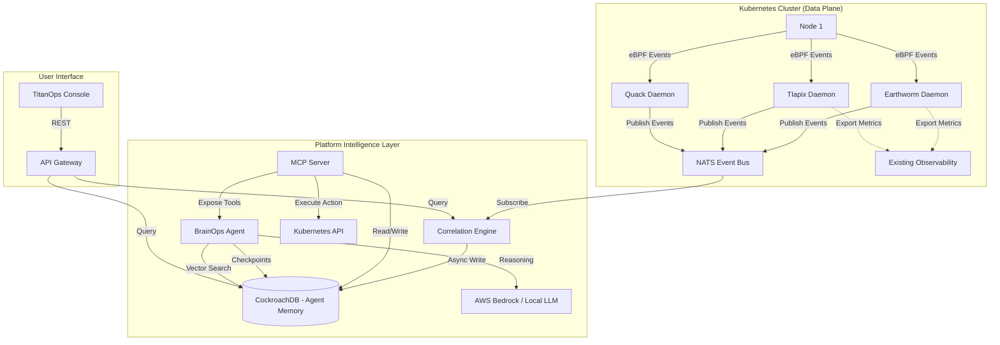

# TitanOps: Agentic Operations Platform with Persistent Memory

- **Version:** 2.0.0
- **Date:** July 03, 2026
- **Author:** TitanOps Core Team
- **Status:** Ready for Implementation
- **Target:** CockroachDB Hackathon + Production Platform

---

## 1. Executive Summary

TitanOps is the **Autonomous Action Layer** for Kubernetes. While observability tools tell you what's wrong, TitanOps fixes it — autonomously, at kernel speed, using eBPF-powered modules that observe, decide, and act without human intervention.

What makes it production-ready: **persistent agentic memory powered by CockroachDB.**

Modules detect and act locally. The OllinAI agent — backed by CockroachDB's persistent memory — remembers past incidents, recognizes patterns across time, correlates events that happened days apart, and makes increasingly better decisions. Memory is not an afterthought; it's what separates a reactive tool from an autonomous operations platform.

### 1.1 Core Value Proposition

| Audience | Value |
|----------|-------|
| **For CTOs** | MTTR drops from hours to seconds; the platform gets *smarter* over time via persistent memory |
| **For SREs** | Eliminates toil. Agent remembers what worked before and applies it automatically |
| **For Developers** | Self-healing cluster that learns — "last time this deploy broke staging, here's why" |

### 1.2 Why CockroachDB as the Memory Layer

| Requirement | Why CockroachDB |
|-------------|----------------|
| **Agent checkpoints** | Serializable consistency ensures agent state is never corrupted, even during pod restarts |
| **Multi-tenant isolation** | Row-Level Security (RLS) provides DynamoDB-grade partition isolation at the SQL layer |
| **Distributed vector index** | Native C-SPANN vector indexing for "have I seen this incident pattern before?" — no separate vector DB needed |
| **Structured operational data** | ACID transactions for incident history, deployment risks, cert ledgers |
| **Temporal queries** | "Show me all incidents on this node in the last 30 days" with indexed TIMESTAMPTZ |
| **Cost-controlled retention** | Row-Level TTL auto-deletes old telemetry; agent memory persists |
| **Multi-region (future)** | Serverless multi-region when the platform goes global — no migration needed |
| **Survives everything** | Agent pod crashes, node failures, network partitions — memory persists |

### 1.3 CockroachDB Tools Used (All 4 Required Tools)

> All submissions must use at least two CockroachDB tools. We use all four.

| # | Tool | How BrainOps Uses It |
|---|------|---------------------|
| 1 | **CockroachDB Cloud Managed MCP Server** | BrainOps connects to the managed MCP endpoint (`cockroachlabs.cloud/mcp`) with a single config snippet from the Cloud Console. Used for: schema exploration at runtime, SQL query execution against incident/resolution tables, vector search queries, and audit logging. Read-only mode for queries; write operations go through our custom MCP tools with approval gates. Zero custom proxy required. |
| 2 | **CockroachDB Distributed Vector Indexing** | Incident embeddings stored and queried at scale using CockroachDB's native distributed vector index (C-SPANN). BrainOps uses semantic search to find similar past incidents without a separate vector store — no reindexing pain, no consistency gaps between operational data and embeddings. All in one database. Used for: "Have I seen this incident before?" similarity search in the RAG pipeline for agent memory. |
| 3 | **ccloud CLI (Agent-Ready)** | BrainOps has direct, secure access to the CockroachDB Cloud control plane via `ccloud`. Uses noun-verb patterns with JSON output for: cluster health monitoring (`ccloud cluster describe --format json`), backup verification (`ccloud backup list`), audit log inspection. Service-account-based RBAC scopes access. Used for: self-healing (verify DB health before critical actions), compliance reporting, infrastructure monitoring. |
| 4 | **CockroachDB Agent Skills Repo** | BrainOps loads curated Agent Skills from `cockroachdb/cursor-plugin` to self-optimize its own database. Skills used: `profiling-statement-fingerprints` (identify slow memory queries), `analyzing-range-distribution` (detect hotspots in incident tables), `analyzing-schema-change-storage-risk` (safe index additions), `designing-application-transactions` (optimize write patterns). BrainOps is a self-maintaining agent — it tunes the very database that stores its memory. |


---

## 2. System Architecture

### 2.1 High-Level Architecture



### 2.2 Architectural Principles

1. **Dual Data Path:** NATS for real-time events (fast, offline-capable); CockroachDB for persistent memory (durable, queryable, the agent's brain).
2. **Module Autonomy:** Each module acts locally without requiring agent approval. CockroachDB memory *enhances* decisions but doesn't gate them.
3. **Memory-First Agent:** BrainOps's power comes from CockroachDB — without memory, it's just another stateless LLM wrapper. With memory, it recognizes patterns, learns from past incidents, and improves over time.
4. **Kernel-First Observation:** All telemetry originates from eBPF (zero overhead, no sidecars).
5. **Local-First AI:** Hot-path decisions use local ONNX models. CockroachDB provides the historical context for BrainOps's deeper reasoning.
6. **Security by Design:** RLS in CockroachDB provides tenant isolation. Agent actions are rate-limited and auditable.

### 2.3 The Memory Architecture

```
┌─────────────────────────────────────────────────────────────────┐
│                    CockroachDB: The Agent's Brain                 │
│                                                                   │
│  ┌──────────────┐  ┌──────────────┐  ┌───────────────────────┐  │
│  │  Checkpoints │  │  Incident    │  │  Vector Embeddings     │  │
│  │  (LangGraph) │  │  History     │  │  (Incident Similarity) │  │
│  │              │  │              │  │                         │  │
│  │  Agent state │  │  What        │  │  "Have I seen this     │  │
│  │  survives    │  │  happened    │  │   pattern before?"     │  │
│  │  restarts    │  │  before?     │  │                         │  │
│  └──────────────┘  └──────────────┘  └───────────────────────┘  │
│                                                                   │
│  ┌──────────────┐  ┌──────────────┐  ┌───────────────────────┐  │
│  │  Deployment  │  │  Resolution  │  │  Audit Trail           │  │
│  │  Risk History │  │  Playbooks  │  │  (Compliance)          │  │
│  │              │  │              │  │                         │  │
│  │  Which       │  │  What fixed  │  │  Who/what did what,    │  │
│  │  deploys     │  │  it last     │  │  when, and why         │  │
│  │  cause       │  │  time?       │  │                         │  │
│  │  incidents?  │  │              │  │                         │  │
│  └──────────────┘  └──────────────┘  └───────────────────────┘  │
│                                                                   │
│  Multi-Tenant (RLS) · Row-Level TTL · Vector Search · ACID       │
└─────────────────────────────────────────────────────────────────┘
```

**Memory Types in CockroachDB:**

| Memory Type | What It Stores | How Agent Uses It |
|-------------|---------------|-------------------|
| **Conversation/Task State** | LangGraph checkpoints — full agent reasoning chain | Resume from any point after restart; replay decisions |
| **Incident History** | Every correlated incident with contributing events | "This node had 3 cert failures in 30 days — escalate" |
| **Vector Embeddings** | Incident descriptions embedded as vectors | Similarity search: "Find incidents that look like this one" |
| **Resolution Playbooks** | What action fixed each incident, and how fast | "Last time, renew_cert + reboot fixed it in 45s" |
| **Deployment Risk** | Deployment history with risk scores and outcomes | "Deploys by this service fail 40% of the time on Fridays" |
| **Audit Trail** | Every autonomous action with full reasoning chain | Compliance, explainability, operator trust |


---

## 3. Module Specifications

### 3.1 Earthworm (Health & Heartbeat)

| Property | Value |
|----------|-------|
| **Language** | Go |
| **Tech Stack** | cilium/ebpf, ONNX Runtime, titanops shared libraries |
| **Function** | Monitors cluster heartbeat via eBPF, detects node/pod anomalies, triggers auto-remediation |
| **Event Types** | `heartbeat_degraded`, `node_down`, `pod_crash`, `network_partition` |
| **Key Actions** | `cordon_node`, `drain_pod`, `restart_pod` |
| **Autonomy** | Acts locally at kernel speed; publishes events to NATS for correlation |

### 3.2 Tlapix (Security & Certificates)

| Property | Value |
|----------|-------|
| **Language** | Rust |
| **Tech Stack** | Aya (eBPF), rustls, AWS KMS (optional) |
| **Function** | Autonomous TLS lifecycle management. Detects shadow certs, predicts expiry, auto-renews |
| **Security Model** | Envelope encryption via KMS; keys never in plaintext |
| **Event Types** | `cert_expiring`, `shadow_cert_detected`, `cert_renewed`, `cert_rotation_failed` |
| **Key Actions** | `renew_certificate`, `rotate_key` |

### 3.3 Quack (Performance & Scheduling)

| Property | Value |
|----------|-------|
| **Language** | Go |
| **Tech Stack** | sched_ext (eBPF), ONNX, titanops shared libraries |
| **Function** | AI-driven CPU scheduling. Detects noisy neighbors, rebalances CPU autonomously |
| **Event Types** | `cpu_anomaly`, `noisy_neighbor_detected`, `rebalance_executed` |
| **Key Actions** | `rebalance_cpu`, `migrate_pod` |

### 3.4 eBeeControl (Threat & Deception)

| Property | Value |
|----------|-------|
| **Language** | Go (rewrite planned from TypeScript) |
| **Tech Stack** | Tetragon (eBPF), ONNX, titanops shared libraries |
| **Function** | Deception engine. Honeytokens, threat classification, pod isolation |
| **Event Types** | `honeytoken_accessed`, `threat_classified`, `pod_isolated` |
| **Key Actions** | `isolate_pod`, `block_ip` |

### 3.5 OllinAI (Change Intelligence Module — separate repo)

| Property | Value |
|----------|-------|
| **Language** | TypeScript (Next.js), Rust (eBPF supply chain agent) |
| **Tech Stack** | Next.js, AWS Bedrock, CI/CD integrations |
| **Function** | Deployment risk scoring, DORA metrics, CI/CD supply chain security via eBPF |
| **Event Types** | `deployment_risk`, `dora_metrics`, `supply_chain_credential_exfil`, `supply_chain_process_anomaly` |
| **Key Actions** | `block_deployment`, `alert_deployer` |
| **Role** | Publishes events to NATS like any other module; BrainOps correlates them with platform-wide data |

### 3.6 BrainOps (Platform Intelligence Layer — lives in titanops-core)

| Property | Value |
|----------|-------|
| **Language** | TypeScript (LangGraph Agent), Go (MCP Server) |
| **Tech Stack** | LangGraph, MCP Server, CockroachDB, AWS Bedrock (optional) |
| **Function** | The platform's agentic intelligence. Correlates across history, recognizes patterns, orchestrates multi-step remediations |
| **Memory** | CockroachDB — checkpoints, incident history, embeddings, resolution playbooks, audit trail |
| **Role** | Enhancement layer — modules work without it; BrainOps makes the platform *smarter over time* |
| **Relationship to modules** | Subscribes to events from ALL modules (Earthworm, Tlapix, Quack, eBeeControl, OllinAI) and reasons across them |

---

## 4. CockroachDB Data Model

### 4.1 Cluster Configuration

| Property | Value |
|----------|-------|
| **Deployment** | CockroachDB Serverless on AWS (us-east-1 to start) |
| **Consistency** | Serializable for agent state and audit; strong consistency for all writes |
| **Features Used** | Vector Search, Row-Level Security (RLS), Row-Level TTL, JSONB, GIN indexes |
| **Multi-Region** | Single region MVP; expand to multi-region when customer demand requires it |

### 4.2 Schema Design

```sql
-- ============================================================
-- SCHEMA: ollinai (Agent Memory & Intelligence)
-- ============================================================
CREATE SCHEMA IF NOT EXISTS ollinai;

-- 1. Agent Checkpoints (LangGraph State Persistence)
-- Enables: Agent survives pod restarts, resumes reasoning mid-task
CREATE TABLE ollinai.checkpoints (
    thread_id TEXT NOT NULL,
    checkpoint_ns TEXT NOT NULL DEFAULT '',
    tenant_id UUID NOT NULL,
    parent_checkpoint_id TEXT,
    checkpoint JSONB NOT NULL,
    metadata JSONB DEFAULT '{}',
    created_at TIMESTAMPTZ DEFAULT now(),
    PRIMARY KEY (tenant_id, thread_id, checkpoint_ns)
);

-- 2. Incident History (What happened, when, and how it was resolved)
-- Enables: "This node had cert failures 3 times in 30 days"
CREATE TABLE ollinai.incidents (
    id UUID PRIMARY KEY DEFAULT gen_random_uuid(),
    tenant_id UUID NOT NULL,
    correlation_id UUID,
    modules TEXT[] NOT NULL,          -- ['earthworm', 'tlapix']
    severity INT NOT NULL,            -- 1-5
    narrative TEXT NOT NULL,           -- Human-readable description
    contributing_events JSONB NOT NULL,-- Full event payloads
    confidence_score INT NOT NULL,    -- 0-100
    resolution_action TEXT,           -- What fixed it
    resolution_time_ms INT,           -- How long the fix took
    node_id TEXT,
    namespace TEXT,
    pod_name TEXT,
    created_at TIMESTAMPTZ DEFAULT now(),
    resolved_at TIMESTAMPTZ,
    INDEX idx_tenant_time (tenant_id, created_at DESC),
    INDEX idx_tenant_node (tenant_id, node_id, created_at DESC),
    INDEX idx_tenant_namespace (tenant_id, namespace, created_at DESC)
);

-- 3. Incident Embeddings (Distributed Vector Index — C-SPANN)
-- Enables: "Find past incidents that look like this one" via sub-50ms similarity search
CREATE TABLE ollinai.incident_embeddings (
    incident_id UUID NOT NULL REFERENCES ollinai.incidents(id),
    tenant_id UUID NOT NULL,
    embedding VECTOR(1536) NOT NULL,  -- OpenAI/Bedrock-compatible dimensions
    model_version TEXT NOT NULL,       -- Track which model generated it
    created_at TIMESTAMPTZ DEFAULT now(),
    PRIMARY KEY (tenant_id, incident_id)
);
-- Distributed vector index using CockroachDB's C-SPANN algorithm
-- Enables fast approximate nearest neighbor search across distributed nodes
CREATE INDEX idx_incident_embedding ON ollinai.incident_embeddings
    USING vectorsearch (embedding vector_cosine_ops)
    WITH (lists = 100);

-- 4. Resolution Playbooks (What worked before)
-- Enables: "Last time, renew_cert + reboot fixed it in 45 seconds"
CREATE TABLE ollinai.resolutions (
    id UUID PRIMARY KEY DEFAULT gen_random_uuid(),
    tenant_id UUID NOT NULL,
    incident_id UUID REFERENCES ollinai.incidents(id),
    action_sequence JSONB NOT NULL,   -- Ordered list of actions taken
    success BOOLEAN NOT NULL,
    duration_ms INT NOT NULL,
    context JSONB,                     -- Conditions that made this fix work
    reuse_count INT DEFAULT 0,        -- How many times agent reused this
    created_at TIMESTAMPTZ DEFAULT now(),
    INDEX idx_tenant_success (tenant_id, success, created_at DESC)
);

-- 5. Deployment Risk History
-- Enables: "Deploys by service X fail 40% of the time"
CREATE TABLE ollinai.deployments (
    id UUID PRIMARY KEY DEFAULT gen_random_uuid(),
    tenant_id UUID NOT NULL,
    service_name TEXT NOT NULL,
    namespace TEXT NOT NULL,
    commit_sha TEXT NOT NULL,
    deployer TEXT NOT NULL,
    risk_score INT NOT NULL,          -- 0-100
    risk_factors JSONB NOT NULL,
    caused_incident BOOLEAN DEFAULT false,
    incident_id UUID REFERENCES ollinai.incidents(id),
    deployed_at TIMESTAMPTZ NOT NULL,
    INDEX idx_tenant_service (tenant_id, service_name, deployed_at DESC),
    INDEX idx_risk_score (tenant_id, risk_score DESC)
);

-- 6. Audit Trail (Every autonomous action, full reasoning chain)
-- Enables: Compliance, explainability, operator trust
CREATE TABLE ollinai.audit_log (
    id UUID PRIMARY KEY DEFAULT gen_random_uuid(),
    tenant_id UUID NOT NULL,
    module TEXT NOT NULL,
    action_type TEXT NOT NULL,
    target TEXT NOT NULL,              -- Node, pod, cert, etc.
    trigger_event_id TEXT,
    confidence FLOAT NOT NULL,
    reasoning JSONB NOT NULL,          -- {observation, analysis, action, alternatives}
    outcome TEXT NOT NULL,             -- success, failed, rejected, paused
    operator_id TEXT,                  -- NULL if autonomous, operator ID if overridden
    duration_ms INT,
    created_at TIMESTAMPTZ DEFAULT now(),
    INDEX idx_tenant_audit (tenant_id, created_at DESC),
    INDEX idx_tenant_module (tenant_id, module, created_at DESC)
);

-- 7. Certificate Ledger (Tlapix persistent state)
-- Enables: Track full cert lifecycle history
CREATE TABLE ollinai.cert_ledger (
    fingerprint TEXT NOT NULL,
    tenant_id UUID NOT NULL,
    service_name TEXT NOT NULL,
    namespace TEXT NOT NULL,
    expiry_date TIMESTAMPTZ NOT NULL,
    status TEXT NOT NULL,              -- VALID, EXPIRING, RENEWING, FAILED
    kms_key_id TEXT,                   -- Reference to KMS key (never the key itself)
    renewal_count INT DEFAULT 0,
    last_renewed_at TIMESTAMPTZ,
    created_at TIMESTAMPTZ DEFAULT now(),
    PRIMARY KEY (tenant_id, fingerprint),
    INDEX idx_expiry (tenant_id, expiry_date ASC)
);

-- ============================================================
-- ROW-LEVEL SECURITY (Multi-Tenancy)
-- ============================================================
ALTER TABLE ollinai.checkpoints ENABLE ROW LEVEL SECURITY, FORCE ROW LEVEL SECURITY;
ALTER TABLE ollinai.incidents ENABLE ROW LEVEL SECURITY, FORCE ROW LEVEL SECURITY;
ALTER TABLE ollinai.incident_embeddings ENABLE ROW LEVEL SECURITY, FORCE ROW LEVEL SECURITY;
ALTER TABLE ollinai.resolutions ENABLE ROW LEVEL SECURITY, FORCE ROW LEVEL SECURITY;
ALTER TABLE ollinai.deployments ENABLE ROW LEVEL SECURITY, FORCE ROW LEVEL SECURITY;
ALTER TABLE ollinai.audit_log ENABLE ROW LEVEL SECURITY, FORCE ROW LEVEL SECURITY;
ALTER TABLE ollinai.cert_ledger ENABLE ROW LEVEL SECURITY, FORCE ROW LEVEL SECURITY;

CREATE POLICY tenant_iso ON ollinai.checkpoints FOR ALL
    USING (tenant_id = current_setting('app.tenant_id')::UUID);
CREATE POLICY tenant_iso ON ollinai.incidents FOR ALL
    USING (tenant_id = current_setting('app.tenant_id')::UUID);
CREATE POLICY tenant_iso ON ollinai.incident_embeddings FOR ALL
    USING (tenant_id = current_setting('app.tenant_id')::UUID);
CREATE POLICY tenant_iso ON ollinai.resolutions FOR ALL
    USING (tenant_id = current_setting('app.tenant_id')::UUID);
CREATE POLICY tenant_iso ON ollinai.deployments FOR ALL
    USING (tenant_id = current_setting('app.tenant_id')::UUID);
CREATE POLICY tenant_iso ON ollinai.audit_log FOR ALL
    USING (tenant_id = current_setting('app.tenant_id')::UUID);
CREATE POLICY tenant_iso ON ollinai.cert_ledger FOR ALL
    USING (tenant_id = current_setting('app.tenant_id')::UUID);

-- ============================================================
-- ROW-LEVEL TTL (Cost Optimization)
-- ============================================================
ALTER TABLE ollinai.incidents SET (ttl_expiration_expression = '((created_at) + INTERVAL ''90 days'')');
ALTER TABLE ollinai.audit_log SET (ttl_expiration_expression = '((created_at) + INTERVAL ''365 days'')');
-- Checkpoints and resolutions: no TTL (agent memory is valuable long-term)
```


### 4.3 How Memory Makes the Agent Useful

**Without CockroachDB (stateless agent):**
```
Incident detected → BrainOps reasons → Takes action → Forgets everything
Next time same incident → Starts from scratch → Same MTTR
```

**With CockroachDB (persistent memory):**
```
Incident detected → BrainOps searches memory:
  → Vector search: "Similar incidents?" → Found 3 matches
  → Resolution lookup: "What fixed them?" → renew_cert + reboot (45s avg)
  → Risk check: "Was there a recent deploy?" → Yes, service-X 10 min ago
  → History: "This node had 3 cert failures in 30 days" → Escalate
  
→ BrainOps acts: Apply proven fix + escalate pattern to operator
→ Memory write: Record resolution, update playbook reuse_count
→ Next time: Even faster — playbook already known, confidence higher
```

**Demo-able scenarios:**

1. **Pattern Recognition:** "BrainOps, this node keeps having cert issues" — queries incident_history, finds pattern, recommends permanent fix
2. **Similarity Search:** New incident arrives → vector search finds similar past incidents → BrainOps applies proven resolution
3. **Deployment Correlation:** Deploy happens → 2 minutes later, heartbeat degrades → BrainOps connects them via temporal + namespace matching in CockroachDB
4. **Playbook Learning:** BrainOps resolves incident → stores resolution → next time same pattern occurs, applies fix immediately with higher confidence
5. **Audit & Explainability:** "Why did TitanOps cordon this node?" → full reasoning chain retrieved from audit_log

---

## 5. MCP Server (BrainOps)

### 5.1 Overview

BrainOps uses a **dual MCP architecture**:

1. **CockroachDB Cloud Managed MCP Server** — BrainOps connects to CockroachDB's managed MCP endpoint for direct database operations (schema discovery, SQL queries, cluster health). Zero infrastructure to deploy — configuration snippet from CockroachDB Cloud Console.

2. **TitanOps Custom MCP Server** — Higher-level domain tools that compose CockroachDB queries with Kubernetes actions and business logic (search similar incidents, execute remediation, store resolutions).

- **Protocol:** Model Context Protocol (MCP) over STDIO or SSE
- **Deployment:** BrainOps agent pod in titanops-core; connects to CockroachDB Cloud MCP via managed endpoint

### 5.2 CockroachDB Cloud Managed MCP Server Integration

BrainOps connects to the **managed MCP endpoint** at `cockroachlabs.cloud/mcp` — zero infrastructure to deploy, config snippet generated directly from Cloud Console.

**Capabilities used:**
- **Schema exploration:** Agent discovers tables, columns, indexes at runtime
- **SQL execution:** Direct queries against incidents, deployments, resolutions, audit_log
- **Vector search queries:** Similarity search via SQL over the distributed vector index
- **Audit logging:** All queries are logged server-side by the managed MCP Server (built-in)
- **Read-only by default:** Safe exploration mode; write operations go through our custom MCP tools with approval gates

```json
// BrainOps MCP client configuration (generated from CockroachDB Cloud Console)
{
  "mcpServers": {
    "cockroachdb": {
      "url": "https://cockroachlabs.cloud/mcp",
      "headers": {
        "Authorization": "Bearer ${COCKROACHDB_API_KEY}"
      }
    }
  }
}
```

**Why the managed MCP server (not a custom proxy):**
- Zero operational overhead — Cockroach Labs manages the endpoint
- Built-in audit logging for every query the agent executes
- Read-only mode prevents accidental data corruption
- Native compatibility with LangChain, Claude, and MCP-compatible clients

### 5.3 ccloud CLI Integration (Agent-Ready)

BrainOps uses `ccloud` as a first-class tool for database lifecycle automation. The CLI is designed for AI agents: consistent noun-verb command patterns, JSON output on every command, and service-account-based RBAC.

**Service Account Setup (scoped RBAC):**
```bash
# Create a service account for BrainOps with limited permissions
ccloud auth service-account create brainops-agent \
  --description "TitanOps BrainOps agent" \
  --format json

# Grant read-only cluster access + backup verification
ccloud auth service-account grant brainops-agent \
  --role CLUSTER_READER \
  --cluster ${CLUSTER_ID}
```

**Agent-invoked operations:**

| Operation | Command | When BrainOps Uses It |
|-----------|---------|----------------------|
| **Cluster health** | `ccloud cluster describe ${ID} --format json` | Before executing remediations — verify DB is healthy |
| **Backup status** | `ccloud backup list --cluster ${ID} --format json` | Periodic audit — ensure agent memory is backed up |
| **Audit log** | `ccloud cluster audit-log --cluster ${ID} --format json` | Compliance — review what queries the agent executed |
| **Connection status** | `ccloud cluster sql-users list --format json` | Self-healing — detect connection pool exhaustion |

```python
# BrainOps tool: verify CockroachDB health before critical action
import subprocess
import json

def check_cluster_health(cluster_id: str) -> dict:
    """Called by BrainOps before executing high-risk remediations."""
    result = subprocess.run(
        ["ccloud", "cluster", "describe", cluster_id, "--format", "json"],
        capture_output=True, text=True
    )
    health = json.loads(result.stdout)
    
    if health["state"] != "RUNNING":
        raise AgentSafetyError(
            f"CockroachDB cluster is {health['state']} — aborting remediation"
        )
    return health
```

**Why ccloud (not raw SQL for infra ops):**
- Service-account RBAC limits blast radius — agent can't drop tables or modify cluster config
- JSON output is machine-parseable — no string parsing errors
- Noun-verb patterns are predictable for LLM tool-use
- Audit trail at the control plane level (separate from SQL audit)

### 5.4 CockroachDB Agent Skills Integration (Self-Optimizing Memory)

BrainOps loads curated Agent Skills from the `cockroachdb/cursor-plugin` repo to monitor and optimize its own CockroachDB memory layer. This makes BrainOps a **self-maintaining agent** — it doesn't just use the database, it actively tunes it.

**Skills loaded:**

| Skill | Category | How BrainOps Uses It |
|-------|----------|---------------------|
| `profiling-statement-fingerprints` | Observability | Periodically profiles queries against `ollinai.incidents` and `ollinai.incident_embeddings` to identify degrading query patterns |
| `profiling-transaction-fingerprints` | Observability | Detects high-retry transactions when multiple agents write resolutions concurrently |
| `analyzing-range-distribution` | Observability | Identifies hotspots in incident tables (e.g., one node generating 80% of events) |
| `analyzing-schema-change-storage-risk` | Operations | Before adding new vector indexes or columns, estimates storage impact to avoid disk exhaustion |
| `designing-application-transactions` | App Development | Optimizes BrainOps's own write patterns — batch sizes, retry logic, connection pooling |
| `benchmarking-transaction-patterns` | App Development | Compares CTE-based writes vs multi-statement transactions for resolution storage |

**Self-optimization workflow:**

```python
# BrainOps periodic self-optimization (runs every 6 hours)
async def optimize_memory_layer():
    """BrainOps uses Agent Skills to tune its own database."""
    
    # 1. Profile slow queries using Agent Skill
    slow_queries = await execute_skill(
        "profiling-statement-fingerprints",
        min_latency_ms=100,
        time_range="6h"
    )
    
    # 2. If vector search is degrading, check range distribution
    if any(q["fingerprint"].contains("vector_cosine") for q in slow_queries):
        distribution = await execute_skill(
            "analyzing-range-distribution",
            table="ollinai.incident_embeddings"
        )
        
        # 3. If hotspotted, evaluate index change
        if distribution["hotspot_detected"]:
            risk = await execute_skill(
                "analyzing-schema-change-storage-risk",
                operation="CREATE INDEX",
                table="ollinai.incident_embeddings"
            )
            
            # 4. Alert operator with recommendation (not auto-execute)
            await alert_operator(
                f"Vector search degrading. Recommend reindex. "
                f"Storage impact: {risk['estimated_bytes']}. "
                f"Hotspot on ranges: {distribution['hot_ranges']}"
            )
```

**Why this matters for the hackathon:**
- Demonstrates deep integration with CockroachDB's ecosystem (not just raw SQL)
- Shows the agent is *intelligent about its own infrastructure*
- "Self-optimizing agent memory" is a genuinely novel application
- Portable: Skills work across Claude, Cursor, LangChain, and any MCP-compatible client

### 5.5 TitanOps Custom MCP Tools

| Tool | Description | CockroachDB Tables Used |
|------|-------------|------------------------|
| `search_similar_incidents(description)` | Vector similarity search for past incidents | `incident_embeddings`, `incidents` |
| `query_incident_history(node, namespace, time_range)` | Structured query on past incidents | `incidents` |
| `get_resolution_playbook(incident_pattern)` | Find what fixed similar issues before | `resolutions` |
| `query_deployment_risk(service, time_range)` | Check deployment history and risk scores | `deployments` |
| `check_cert_status(namespace)` | Query certificate health and renewal history | `cert_ledger` |
| `execute_remediation(action, target, reason)` | Execute action + write to audit trail | `audit_log` + K8s API |
| `store_resolution(incident_id, actions, success, duration)` | Save what worked for future reuse | `resolutions` |
| `get_node_history(node_id, days)` | Full history of a node's incidents | `incidents`, `audit_log` |

### 5.6 Security

- Validates `tenant_id` before every CockroachDB query (RLS enforced)
- Human-in-the-Loop for high-risk actions (node drain, production namespace changes)
- Rate-limited: max 10 actions/minute per tenant
- Circuit breaker: >3 failed actions in 5 minutes → auto-pause, alert operator
- All tool invocations logged to `audit_log`

### 5.7 Agent Configuration (LangGraph + CockroachDB)

```python
# BrainOps Agent Setup
import os
from langgraph.graph import StateGraph
from langchain_cockroachdb import AsyncCockroachDBSaver

async def create_brainops_agent():
    # CockroachDB as persistent memory
    checkpointer = AsyncCockroachDBSaver.from_conn_string(
        os.environ["COCKROACHDB_URI"]
    )
    await checkpointer.setup()
    
    # Agent with memory-backed reasoning
    graph = StateGraph(AgentState)
    graph.add_node("reason", reason_with_memory)
    graph.add_node("search_memory", vector_search_incidents)
    graph.add_node("act", execute_via_mcp)
    graph.add_node("remember", store_resolution)
    
    # Compile with CockroachDB checkpointer
    agent = graph.compile(checkpointer=checkpointer)
    return agent
```

---

## 6. Data Flow: End-to-End

### 6.1 Real-Time Path (NATS — existing, works today)

```
eBPF Event → Module (local ONNX inference) → Autonomous Action (immediate)
                                            → Publish to NATS
                                                 → Correlation Engine (in-memory)
                                                      → Auto-action if confidence ≥ threshold
                                                 → Export Adapters (Prometheus, OTLP, etc.)
```

### 6.2 Memory Path (CockroachDB — new, the hackathon deliverable)

```
Correlation Engine detects incident
  → Async batch write to ollinai.incidents
  → Generate embedding → write to ollinai.incident_embeddings
  → Notify BrainOps agent (via NATS subscription)

BrainOps Agent wakes up:
  → MCP: search_similar_incidents(new_incident_description)
       → CockroachDB vector search → "Found 3 similar incidents"
  → MCP: get_resolution_playbook(pattern)
       → CockroachDB query → "renew_cert + reboot worked 3/3 times"
  → MCP: execute_remediation(action="renew_cert", target=node_id, reason="...")
       → Write to audit_log → Execute via K8s API
  → MCP: store_resolution(incident_id, actions, success=true, duration_ms=45000)
       → CockroachDB write → Playbook updated for next time
  → Checkpoint saved to CockroachDB (BrainOps can resume if interrupted)
```

### 6.3 Dashboard Path

```
Dashboard → API Gateway → CockroachDB queries:
  → Recent incidents (ollinai.incidents)
  → Audit trail (ollinai.audit_log)
  → Deployment risks (ollinai.deployments)
  → Resolution success rates (ollinai.resolutions)
  → Agent reasoning chains (ollinai.checkpoints)
```


---

## 7. Security & Compliance

### 7.1 Multi-Tenancy

| Layer | Mechanism |
|-------|-----------|
| **CockroachDB** | Row-Level Security (RLS) — `tenant_id` column on all tables, policy enforced at DB layer |
| **NATS** | Subject namespacing: `tenant.<id>.module.<name>` |
| **MCP Server** | Sets `app.tenant_id` session variable before every query |
| **API Gateway** | JWT-based tenant extraction; passes tenant context to all services |

### 7.2 Key Management (Tlapix)

- Private keys never stored in plaintext anywhere
- **With AWS KMS:** Envelope encryption — data key encrypted by KMS, ciphertext in `cert_ledger`
- **Without KMS (air-gap):** File-based encryption with restricted filesystem permissions
- Every key access logged to `audit_log` in CockroachDB

### 7.3 eBPF Safety

- All programs pass Linux Kernel Verifier (no infinite loops, bounded memory)
- Modules run with minimal capabilities (`CAP_BPF`, `CAP_PERFMON`)
- Fallback to user-space polling if eBPF load fails

### 7.4 Agent Safety

| Control | Implementation |
|---------|---------------|
| **Rate Limiting** | Max 10 MCP tool calls per minute per tenant |
| **Approval Gates** | High-risk actions require human approval via dashboard |
| **Circuit Breaker** | >3 failed actions in 5 min → auto-pause + alert |
| **Audit** | Every action recorded in CockroachDB with full reasoning chain |
| **Rollback** | Resolution playbooks track which actions can be safely reversed |

---

## 8. Deployment on AWS

### 8.1 Infrastructure

| Component | AWS Service | Purpose |
|-----------|-------------|---------|
| **CockroachDB** | CockroachDB Serverless (us-east-1) | BrainOps memory, state persistence |
| **Kubernetes** | EKS | Module deployment, NATS, correlation engine, BrainOps |
| **LLM** | AWS Bedrock (Claude/Anthropic) | BrainOps reasoning (optional — works with local LLM too) |
| **Key Management** | AWS KMS | Tlapix certificate encryption |
| **Container Registry** | ECR | Module container images |
| **IAM** | IRSA (IAM Roles for Service Accounts) | Fine-grained permissions per module |

### 8.2 Installation

```bash
# Full platform with CockroachDB memory
helm install titanops titanops/titanops \
  --set cockroachdb.uri=$COCKROACHDB_URI \
  --set aws.region=us-east-1 \
  --set brainops.enabled=true \
  --set brainops.bedrock.modelId="anthropic.claude-3-haiku-20240307" \
  --set ollinai.enabled=true

# Minimal (no cloud dependencies — offline mode)
helm install titanops titanops/titanops \
  --set brainops.enabled=false \
  --set earthworm.enabled=true \
  --set tlapix.enabled=true
```

### 8.3 Cost Profile

| Component | Cost | Notes |
|-----------|------|-------|
| CockroachDB Serverless | Free tier: 5GB + 50M RUs | Sufficient for MVP; ~$50-100/month at moderate scale |
| EKS | ~$75/month (control plane) | Plus node costs |
| Bedrock (Claude Haiku) | ~$0.25/1M input tokens | Only for agent reasoning, not hot path |
| NATS | $0 (in-cluster pod) | 15MB RAM |
| KMS | $1/key/month | Only for Tlapix cert encryption |

---

## 9. Roadmap & Milestones

### Phase 1: Hackathon MVP (Weeks 1–2) ← CURRENT FOCUS

- [ ] Deploy CockroachDB Serverless on AWS (single region)
- [ ] Implement schema (checkpoints, incidents, embeddings, resolutions, audit)
- [ ] Build MCP Server with core tools (search_similar, query_history, execute_remediation, store_resolution)
- [ ] Implement BrainOps Agent with LangGraph + CockroachDB Checkpointer
- [ ] Connect correlation engine → async writes to CockroachDB incident_history
- [ ] Vector embedding pipeline for incident similarity search
- [ ] Demo: BrainOps resolves incident using memory ("I've seen this before, here's what fixed it")
- [ ] Demo: BrainOps survives restart, resumes mid-task from checkpoint

### Phase 2: Platform Integration (Weeks 3–4)

- [ ] Connect all modules to NATS event bus
- [ ] OllinAI adapter: deployment risk events from CI/CD → NATS (OllinAI stays in its own repo)
- [ ] Dashboard: show BrainOps reasoning, incident history, resolution playbooks
- [ ] Human-in-the-Loop approval workflow via dashboard
- [ ] Grafana dashboard pack showing CockroachDB-backed metrics

### Phase 3: Production Hardening (Months 2–3)

- [ ] Row-Level Security enforcement across all tables
- [ ] Agent safety: rate limiting, circuit breakers, rollback support
- [ ] Envelope encryption for Tlapix via KMS
- [ ] Multi-tenant onboarding flow
- [ ] SOC2 preparation via audit trail completeness

### Phase 4: Scale (Months 4–6)

- [ ] Multi-region CockroachDB (when customer latency requirements demand it)
- [ ] Resolution playbook marketplace (share fixes across tenants)
- [ ] Advanced vector search: incident clustering, anomaly pattern detection
- [ ] DORA metrics dashboard with CockroachDB time-series queries

---

## 10. Hackathon Criteria Alignment

### Agentic Memory Design ✅

CockroachDB is not just a data store — it IS the agent's brain:
- **6 memory types** in CockroachDB: checkpoints, incidents, embeddings, resolutions, deployments, audit
- **Memory drives every decision:** Agent never acts without consulting history first
- **Memory improves over time:** Resolution playbooks get better with each use (reuse_count, success rate)
- **Scale:** Designed for millions of incidents, thousands of embeddings, hundreds of concurrent agents (RLS-isolated tenants)

### Technical Implementation ✅

**CockroachDB Tools Used (All 4 of 4):**

1. **CockroachDB Cloud Managed MCP Server** (`cockroachlabs.cloud/mcp`)
   - Config snippet from Cloud Console — zero proxy deployment
   - Read-only mode for safe agent exploration
   - Built-in audit logging of all agent queries
   - BrainOps uses for: schema discovery, SQL queries, vector search

2. **Distributed Vector Indexing (C-SPANN)**
   - `CREATE INDEX USING vectorsearch (embedding vector_cosine_ops)`
   - Sub-50ms similarity search across distributed nodes
   - No separate vector DB — embeddings live next to operational data
   - BrainOps uses for: "Find similar past incidents" semantic search

3. **ccloud CLI (Agent-Ready)**
   - Noun-verb patterns + JSON output = LLM-friendly
   - Service-account RBAC scopes agent permissions
   - BrainOps uses for: cluster health check before remediations, backup verification, audit log inspection

4. **Agent Skills Repo (Open Source)**
   - Skills loaded: `profiling-statement-fingerprints`, `analyzing-range-distribution`, `analyzing-schema-change-storage-risk`, `designing-application-transactions`
   - BrainOps is self-optimizing — uses Skills to monitor and tune its own memory layer
   - Portable across Claude, Cursor, LangChain, any MCP-compatible client

**Additional CockroachDB features:**
- **LangGraph AsyncCockroachDBSaver:** Native checkpointer for agent state
- **Row-Level Security (RLS):** Database-enforced tenant isolation
- **Row-Level TTL:** Automated cost control (incidents 90d, audit 365d, playbooks forever)
- **JSONB + GIN indexes:** Flexible event payloads with fast querying
- **Serializable isolation:** Agent state never corrupted by concurrent access

### Real-World Impact ✅

- **Problem:** SRE teams spend 60%+ of time on repetitive incident response. Average MTTR for K8s incidents: 1-4 hours.
- **Solution:** BrainOps + CockroachDB memory reduces MTTR to seconds by applying proven fixes from history
- **Scale:** Kubernetes runs 50%+ of containerized workloads globally. Every cluster needs autonomous operations.
- **Business model:** Open source modules + paid intelligence layer (BrainOps) = VC-fundable

### Production Readiness ✅

| Concern | How We Address It |
|---------|------------------|
| **Security** | RLS multi-tenancy, KMS encryption, agent rate limiting, approval gates |
| **Observability** | Every agent action in audit_log; dashboard shows reasoning chains; Prometheus metrics from all modules |
| **Scalability** | CockroachDB scales horizontally; NATS handles 10M+ events/sec; modules are stateless pods |
| **Resilience** | Agent restarts from checkpoint; modules work without DB; circuit breakers prevent runaway actions |
| **Access control** | Scoped MCP tools — agent can't execute arbitrary SQL or K8s commands |
| **Disaster recovery** | CockroachDB automated backups; agent memory is the most valuable data, gets highest durability |

### Creativity & Originality ✅

**What makes this genuinely new:**

1. **eBPF + Agentic Memory:** No one else combines kernel-level observation (eBPF) with persistent agent memory. Observability tools see events; we *remember* them and learn from them.

2. **Resolution Playbooks as memory:** The agent doesn't just remember incidents — it remembers *what fixed them*. This is what makes agentic systems different from traditional apps: they get better with use.

3. **Self-optimizing agent memory:** BrainOps uses CockroachDB Agent Skills to monitor and tune the very database that stores its memory. When vector search degrades, the agent diagnoses and recommends fixes using the same skills a human DBA would use. The agent maintains itself.

4. **Dual data path (NATS + CockroachDB):** Real-time autonomy (modules act locally via NATS at kernel speed) + persistent intelligence (agent reasons over history via CockroachDB). Most agentic systems are purely reactive; ours has both reflexes AND memory.

5. **Memory-gated confidence:** The agent's confidence in a remediation action increases when it finds matching resolution playbooks in CockroachDB. More history = better decisions. This is fundamentally different from stateless LLM-based automation.

6. **Cross-domain correlation in memory:** "This CPU spike + this cert failure + this deployment = crypto miner attack." No single observability tool sees across all these domains. CockroachDB memory enables temporal correlation across time windows that exceed any streaming system's capacity.

---

## 11. Appendix: Funding & Support Strategy

### 11.1 AWS Activate

| Program | Details |
|---------|---------|
| **Founders** | $1,000 credits (Self-serve, 7 days) |
| **Generative AI** | Up to $300,000 credits (Focus on "Agentic Ops with persistent memory") |
| **Action** | Apply with hackathon demo as proof of concept |

### 11.2 Cockroach Labs

| Program | Details |
|---------|---------|
| **Serverless Free Tier** | 5GB + 50M RUs/month (Immediate) |
| **Startup Program** | $10k–$20k credits + Technical Support |
| **Hackathon** | Winning/placing demonstrates partnership potential |
| **Action** | Leverage hackathon submission for startup program application |

### 11.3 NVIDIA Inception

| Program | Details |
|---------|---------|
| **Value** | DGX Cloud credits, AI resources, Go-to-Market support |
| **Relevance** | ONNX-based local inference + embedding generation pipeline |
| **Action** | Apply at nvidia.com/inception with platform demo |

---

## 12. Appendix: Architecture Decision Records

### ADR-1: CockroachDB as BrainOps Memory (Not Event Bus)

**Decision:** CockroachDB stores BrainOps's persistent memory. NATS remains the real-time event bus.

**Rationale:**
- CockroachDB excels at: durable state, vector search, ACID transactions, RLS, temporal queries
- NATS excels at: real-time pub/sub, low latency, zero external dependencies, air-gap
- Using both plays to their strengths — CockroachDB for the brain, NATS for the nervous system
- Modules remain functional if CockroachDB is temporarily unreachable (autonomous actions via ONNX)

### ADR-2: Vector Search for Incident Similarity

**Decision:** Store incident embeddings in CockroachDB for vector similarity search.

**Rationale:**
- "Have I seen this before?" is the most valuable question an agent can answer
- CockroachDB native vector search eliminates need for a separate vector DB (Pinecone, Weaviate)
- Keeps all agent memory in one store — simpler operations, consistent RLS, single backup strategy

### ADR-3: Resolution Playbooks as First-Class Data

**Decision:** Explicitly store what fixed each incident, track success rates, and reuse automatically.

**Rationale:**
- This is what makes the agent *learn* — not just remember, but improve
- Playbooks with high reuse_count and success=true get applied with higher confidence
- Enables the demo scenario: "Last time this exact pattern occurred, X fixed it in 45 seconds"
- Future: Share anonymized playbooks across tenants (marketplace)

### ADR-4: Modules Stay Autonomous (Including OllinAI)

**Decision:** All modules (Earthworm, Tlapix, Quack, eBeeControl, OllinAI) act locally and publish events to NATS. BrainOps is the platform intelligence layer in titanops-core that subscribes to all module events.

**Rationale:**
- If CockroachDB is unreachable, modules still protect the cluster
- Hot-path latency (kernel event → action) stays <10ms
- BrainOps adds value for complex/historical reasoning, not for obvious immediate actions
- OllinAI is a module like any other — its CI/CD intelligence feeds into BrainOps just like Earthworm's heartbeat data
- This is the production-grade story investors want to hear

### ADR-5: Single Region to Start, Multi-Region When Needed

**Decision:** Deploy CockroachDB Serverless in us-east-1 only for MVP.

**Rationale:**
- Agent memory queries are async — latency tolerance is 50-100ms
- Multi-region adds cost and complexity without proven need at hackathon stage
- CockroachDB Serverless makes multi-region migration trivial when the time comes
- Demonstrates architectural readiness without premature optimization

---

*End of Specification*
