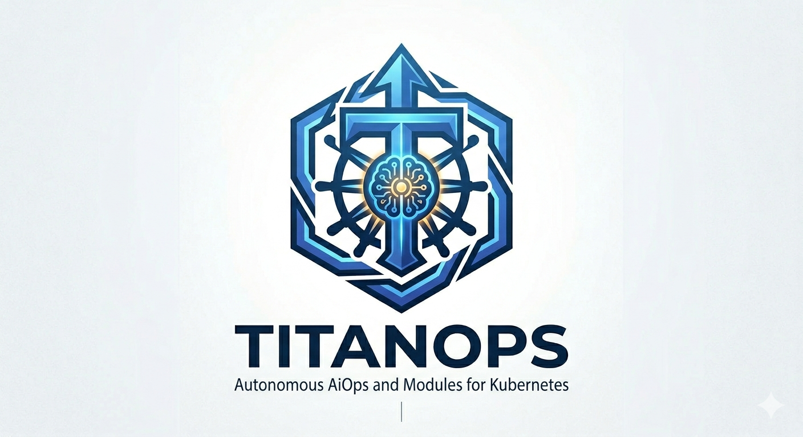

# TitanOps



**Autonomous AiOps Modules for Kubernetes**

> "Your observability stack tells you what's wrong. TitanOps fixes it."

TitanOps is a platform of autonomous, eBPF-powered modules that plug into your existing observability stack and add capabilities no single tool can provide: kernel-level health monitoring, autonomous certificate management, deception-based threat detection, AI-driven CPU scheduling, and deployment risk intelligence — all correlated in real time.

---

## Mission

Eliminate human toil in Kubernetes operations by deploying autonomous agents that observe at kernel depth, reason with local AI, and act at machine speed — without replacing the tools teams already trust.

---

## Core Pattern

Every TitanOps module follows the same architecture:

```
eBPF (kernel observation) → AI (analysis/decision) → Autonomous Action
```

- **Observe** at the kernel level via eBPF — no sidecars, no agents polling APIs
- **Decide** locally with ONNX models — zero cloud dependency on the hot path
- **Act** autonomously — cordon nodes, renew certs, isolate pods, rebalance CPU
- **Export** to whatever backend you already use — Prometheus, Datadog, Splunk, Grafana

---

## The Portfolio

| Module | Domain | What It Does | Tech | Status |
|--------|--------|-------------|------|--------|
| [**Earthworm**](https://github.com/mercadoalex/earthworm) 🪱 | Health | K8s cluster heartbeat monitoring via eBPF, anomaly detection & auto-remediation | Go · cilium/ebpf · ONNX | ✅ Active |
| [**Tlapix**](https://github.com/mercadoalex/tlapix) 🦡 | Security | Autonomous TLS certificate lifecycle guardian — detect shadow certs, predict expiry, auto-renew | Rust · Aya · ONNX Runtime | ✅ Active |
| [**eBeeControl**](https://github.com/mercadoalex/ebeecontrol) 🐝 | Threat | Autonomous deception engine — honeytokens, threat classification, pod isolation | Go · Tetragon · titanops-ai | ✅ Active |
| [**Quack**](https://github.com/mercadoalex/quack) 🦆 | Performance | AI-powered container CPU scheduling via sched_ext | Go · sched_ext · ONNX | ✅ Active |
| [**OllinAI**](https://github.com/mercadoalex/OllinAI-) 🔮 | Change Intelligence | AI deployment verification, risk scoring, DORA metrics, incident correlation | Go · titanops-k8s · titanops-export | ✅ Active |

---

## Technical Architecture

```
┌─────────────────────────────────────────────────────────────────────────┐
│                         TitanOps Platform Core                           │
│                                                                          │
│  cmd/titanops ─── RuntimeKernel ─── Correlation Engine ─── API Gateway  │
│       │                │                    │                   │         │
│       │        Module Lifecycle             │              Dashboard     │
│       │       (Start/Stop/Health)    NATS Event Bus        React 18     │
│       │                │                    │              Vite 5        │
│  ┌────┴────────────────┴────────────────────┴───────────────────┘        │
│  │                    Shared Go Libraries                                │
│  │  titanops-platform · titanops-ai · titanops-k8s                       │
│  │  titanops-export · titanops-config                                    │
│  └──────────────────────────────────────────────────────────────────── │
└─────────────────────────────────────────────────────────────────────────┘
         │              │               │              │           │
    Earthworm       Tlapix        eBeeControl       Quack      OllinAI
      (Go)          (Rust)          (Go)            (Go)        (Go)
         │              │               │              │           │
    ┌────┴──────────────┴───────────────┴──────────────┴───────────┘
    │                    Linux Kernel (eBPF)                         │
    │  cilium/ebpf · Aya · Tetragon · sched_ext · libbpf            │
    └───────────────────────────────────────────────────────────────┘
```

### Platform Kernel (Module/Kernel Contract)

Every module implements a formal `platform.Module` interface. The kernel manages lifecycle with fault isolation:

```go
// Every module satisfies this contract:
type Module interface {
    ID() string
    Version() string
    Start(ctx context.Context, kernel Kernel) error
    Stop(ctx context.Context) error
    HealthCheck(ctx context.Context) HealthStatus
}

// The kernel provides shared services:
type Kernel interface {
    Emit(ctx context.Context, event export.Event) error
    Subscribe(filter EventFilter, handler EventHandler) Subscription
    K8sClient() k8s.Client
    AIProvider() ai.Provider
    ModuleConfig(moduleID string) json.RawMessage
    GetModule(id string) Module
}
```

Benefits:
- **Panic isolation** — a crashing module never takes down the platform
- **Unified health** — `/api/modules/health` aggregates all module status
- **Shared services** — one K8s client, one AI provider, one event bus
- **Compile-time safety** — modules are Go packages, not dynamic plugins

### Data Flow

```
Kernel eBPF → Userspace Decode → Local AI Inference → Decision → Action
                                                          │
                                                     Event Emit
                                                          │
                                              Platform Kernel (routing)
                                                          │
                                                 Correlation Engine
                                                    │         │
                                              API Gateway   Export Backends
                                                    │         │
                                              Dashboard    Prometheus / OTLP
                                                           Splunk / Datadog
                                                           Webhooks (Slack,
                                                           PagerDuty)
```

### Platform Components

| Component | Purpose | Tech |
|-----------|---------|------|
| `cmd/titanops` | Platform entry point — creates kernel, registers modules, starts all | Go |
| `shared/titanops-platform` | Module/Kernel contract + RuntimeKernel implementation | Go |
| `correlation/` | Cross-module event correlation, confidence scoring, auto-actions | Go, NATS, Protobuf |
| `gateway/` | REST API serving decisions, actions, audit trail | Go, net/http |
| `dashboard/` | Autonomous operations command center | React 18, TypeScript, Vite 5 |
| `shared/titanops-ai` | ONNX inference + pluggable cloud backends (Gemini, Bedrock, Vertex) | Go |
| `shared/titanops-k8s` | Common K8s client, secret reading, pod operations | Go |
| `shared/titanops-export` | Fan-out export: Prometheus, OTLP, Splunk HEC, Dynatrace, webhooks | Go |
| `shared/titanops-config` | Unified config loading, validation, hot reload | Go |
| `helm/titanops` | Umbrella Helm chart — one install for the full platform | Helm 3 |
| NATS event bus | In-cluster pub/sub (~15MB RAM), JetStream optional | NATS |

### AI Strategy: Local-First, Cloud-Optional

| Tier | Backend | Cost | Use Case |
|------|---------|------|----------|
| 1 (default) | Local ONNX | $0 | Inference, decisions, actions — always works offline & air-gapped |
| 2 (optional) | Cloud ML (Bedrock, Vertex, SageMaker) | $$ | Model training at scale |
| 3 (optional) | LLM (Gemini, Claude, GPT) | $$$ | Natural language explanations, incident reports |

The hot path (inference → decision → action) **never** depends on network calls. Cloud is only for offline training and optional enrichment.

---

## Language Strategy

**Target: Go everywhere except Rust where eBPF demands it, TypeScript only for the dashboard.**

| Layer | Language | Rationale |
|-------|----------|-----------|
| Platform core | Go | Single binary, goroutines, client-go native |
| All modules (except Tlapix) | Go | Shared libs work directly, one toolchain |
| Tlapix eBPF probes | Rust | Aya requires Rust for eBPF programs |
| Dashboard | TypeScript/React | Standard for frontend |

This eliminates:
- `node_modules` from any backend service
- Multi-language Docker images
- Duplicate dependency management across ecosystems
- Context switching between TypeScript and Go patterns

---

## Strategic Plan

### Phase Roadmap

| Phase | Duration | Outcome |
|-------|----------|---------|
| 1. Individual modules | 2-3 weeks | Each module independently installable via `helm install` |
| 2. Unified Helm chart | 1-2 weeks | One command installs the full platform with module toggles |
| 3. Grafana dashboards | 1 week | Pre-built visual proof-of-value for each module |
| 4. Integration adapters | 2-3 weeks | Every module exports to every backend (Prometheus, OTLP, Splunk, etc.) |
| 5. Correlation engine | 3-4 weeks | Cross-module intelligence — the paid differentiator |
| 6. Go-to-market | Ongoing | CNCF landscape, Artifact Hub, KubeCon, Hacker News |

### Business Model

| Tier | Includes | Price |
|------|----------|-------|
| **Open Source** | All modules, Helm charts, Grafana dashboards | Free |
| **Pro** | Correlation engine, managed AI models, priority support | $/node/month |
| **Enterprise** | Custom integrations, SLA, dedicated support, training | Contact |

### The Moat

The correlation of signals across kernel health, certificate security, deception-based threat detection, CPU scheduling, and deployment risk is unique. No single observability vendor covers all these domains at kernel depth with autonomous action.

---

## Comparison

| Capability | Datadog | Grafana | Splunk | Falco | **TitanOps** |
|------------|---------|---------|--------|-------|-------------|
| eBPF kernel observation | ❌ | ❌ | ❌ | ✅ | ✅ |
| Autonomous certificate renewal | ❌ | ❌ | ❌ | ❌ | ✅ (Tlapix) |
| Deception-based threat detection | ❌ | ❌ | ❌ | ❌ | ✅ (eBeeControl) |
| AI-driven CPU scheduling | ❌ | ❌ | ❌ | ❌ | ✅ (Quack) |
| Cluster heartbeat + auto-remediation | ❌ | ❌ | ❌ | ❌ | ✅ (Earthworm) |
| Deployment verification (auto-detect regressions) | ❌ | ❌ | ❌ | ❌ | ✅ (OllinAI) |
| Deployment risk scoring + DORA | Partial | ❌ | Partial | ❌ | ✅ (OllinAI) |
| Cross-module signal correlation | ✅ (within own data) | ✅ (within own data) | ✅ (within own data) | ❌ | ✅ (across kernel domains) |
| Local-first AI (no cloud required) | ❌ | ❌ | ❌ | ❌ | ✅ |
| Works with YOUR existing stack | ❌ (replaces it) | ❌ (replaces it) | ❌ (replaces it) | ✅ | ✅ |
| Autonomous action execution | ❌ | ❌ | ❌ | Partial | ✅ |

**Key differentiator**: TitanOps doesn't replace your observability stack — it gives it superpowers. Keep Grafana, keep Prometheus, keep your alerts. Add TitanOps and your cluster gains autonomous capabilities that no single vendor provides.

---

## Quick Start

```bash
# Install the full platform (modules are toggleable)
helm install titanops titanops/titanops \
  --set earthworm.enabled=true \
  --set tlapix.enabled=true \
  --set ebeecontrol.enabled=true \
  --set quack.enabled=true \
  --set correlation.enabled=true

# Or install a single module
helm install earthworm titanops/earthworm
```

### Development Setup

```bash
# Clone
git clone https://github.com/mercadoalex/titanops.git
cd titanops

# Build all Go modules (including ebeecontrol, earthworm, platform)
go work sync
go build ./...

# Run tests (with race detector)
go test -race ./...

# Run property-based tests
go test -run Property ./... -count=1

# Run the platform locally
go run ./cmd/titanops

# Dashboard development
cd dashboard && npm install && npm run dev
```

---

## Repository Structure

```
titanops/
├── cmd/titanops/              # Platform entry point (kernel + modules + gateway)
├── correlation/               # Cross-module correlation engine
├── gateway/                   # REST API gateway
├── dashboard/                 # React command center UI
├── modules/
│   ├── earthworm/             # Heartbeat monitoring module (platform.Module)
│   ├── ebeecontrol/           # Deception engine module (platform.Module)
│   └── ollinai/               # Deployment risk module (platform.Module)
├── shared/
│   ├── titanops-platform/     # Module/Kernel contract + RuntimeKernel
│   ├── titanops-ai/           # ONNX + pluggable cloud AI
│   ├── titanops-k8s/          # Common K8s patterns
│   ├── titanops-export/       # Multi-backend export (Prometheus, OTLP, etc.)
│   └── titanops-config/       # Config loading & validation
├── helm/
│   ├── titanops/              # Umbrella Helm chart
│   └── charts/                # Module sub-charts
├── grafana/                   # Pre-built dashboard JSON files
├── proto/                     # Protobuf event schema definitions
├── docs/                      # Platform documentation
├── infra/                     # Infrastructure definitions
├── scripts/                   # Build & release scripts
├── go.work                    # Go workspace (multi-module)
└── VERSIONING.md              # Semver policy
```

---

## Key Principles

1. **Pipeline-first** — All data flows as: eBPF Event → Decode → Infer → Decide → Act → Emit → Export
2. **Module contract** — Every module implements `platform.Module`; the kernel manages lifecycle
3. **Fault isolation** — A panicking module is caught and reported, never propagated
4. **Lock-free hot path** — No mutexes between kernel event and action execution
5. **Zero-copy internally** — Pass struct pointers through pipeline, serialize only at boundaries
6. **Batch at boundaries** — Accumulate events, flush in batches to export backends
7. **Idempotent exports** — Every event has a UUID; backends can deduplicate safely
8. **Graceful degradation** — Cloud AI down → local ONNX → rule-based fallback
9. **Vendor-neutral** — Customer picks their observability backend; we export to all of them
10. **Go-first** — One language for the backend eliminates toolchain sprawl

---

## Documentation

| Document | Description |
|----------|-------------|
| [Platform Integration Plan](docs/platform-integration-plan.md) | Full strategic plan, phases, integrations, AI/ML strategy |
| [Engineering Standards](docs/engineering-standards.md) | Code patterns, testing strategy, quality bar (inspired by Cilium, CockroachDB, NATS) |
| [Landscape Overview](docs/landscape-overview.md) | Visual architecture diagram with Mermaid charts |
| [Versioning Policy](VERSIONING.md) | Semver strategy across all components |

---

## Contributing

1. All backend modules live in this monorepo under `modules/`
2. Platform-level work (correlation, gateway, dashboard, shared libs) lives here
3. Run `go test -race ./...` before submitting PRs
4. Property-based tests are mandatory for correctness-critical code
5. New modules must implement `platform.Module` — see `modules/earthworm/module.go` for the pattern
6. See [Engineering Standards](docs/engineering-standards.md) for the full quality bar

---

## License

MIT

---

## Platform Landscape


