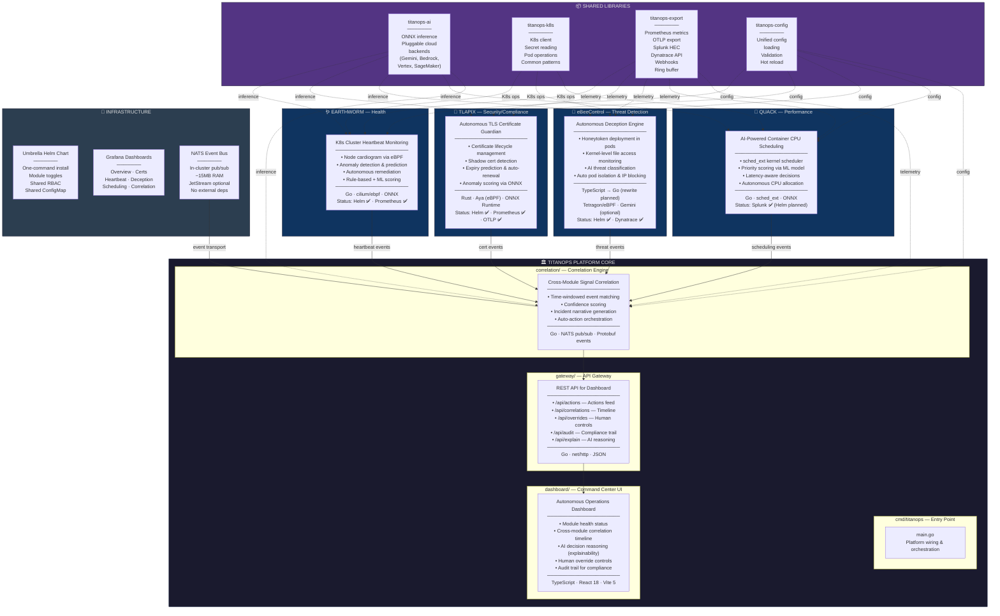

# TitanOps — Architecture Overview

> "Your observability stack tells you what's wrong. TitanOps fixes it."

**TitanOps** is an autonomous AiOps platform for Kubernetes. It doesn't replace your observability stack — it adds autonomous capabilities that plug into whatever tools you already use. eBPF observes the kernel. AI decides what to do. Actions execute at kernel speed.

---

## Platform At a Glance

```
┌──────────────────────────────────────────────────────────────────────────────────────────┐
│                              TITANOPS PLATFORM                                            │
│         Autonomous AiOps Modules for Kubernetes                                          │
│         Position: Observability tells you what's wrong. TitanOps fixes it.               │
│                                                                                          │
│   Core Pattern:  eBPF (kernel observation) → AI (analysis/decision) → Autonomous Action  │
│   Core Tech:     Go · Rust · TypeScript/React · eBPF · ONNX · Helm · NATS               │
│   Architecture:  Local-first AI · Cloud-optional · Vendor-neutral                        │
└──────────────────────────────────────────────────────────────────────────────────────────┘
```

---

## High-Level Architecture Diagram



---

## Data Flow: From Kernel to Dashboard

```mermaid
flowchart LR
    subgraph KERNEL["Linux Kernel"]
        BPF["eBPF Programs<br/>(observation)"]
    end

    subgraph USERSPACE["Userspace Agents"]
        DECODE["Decode<br/>Events"]
        INFER["AI Inference<br/>(Local ONNX)"]
        DECIDE["Decision<br/>Engine"]
        ACT["Action<br/>Execution"]
    end

    subgraph PLATFORM["TitanOps Platform"]
        BUS["NATS<br/>Event Bus"]
        CORR2["Correlation<br/>Engine"]
        GW2["API<br/>Gateway"]
        DASH2["React<br/>Dashboard"]
    end

    subgraph EXPORT["Export Backends"]
        PROM["Prometheus"]
        OTLP["OTLP/OTel"]
        SPLK["Splunk"]
        DT["Dynatrace"]
        WH["Webhooks<br/>(Slack/PagerDuty)"]
    end

    BPF --> DECODE --> INFER --> DECIDE --> ACT
    ACT -->|"emit event"| BUS
    BUS --> CORR2
    CORR2 --> GW2 --> DASH2
    CORR2 --> PROM
    CORR2 --> OTLP
    CORR2 --> SPLK
    CORR2 --> DT
    CORR2 --> WH
```



---

## Module Summary Matrix

| Module | Domain | What It Does | Core Tech | eBPF Framework | AI Model | Status |
|--------|--------|-------------|-----------|----------------|----------|--------|
| **Earthworm** 🪱 | Health | K8s cluster heartbeat monitoring, anomaly detection & auto-remediation | Go | cilium/ebpf | ONNX (anomaly) | Helm ✅, Prometheus ✅ |
| **Tlapix** 🦡 | Security | Autonomous TLS certificate lifecycle — detect, predict, renew | Rust | Aya | ONNX (anomaly) | Helm ✅, Prometheus ✅, OTLP ✅ |
| **eBeeControl** 🐝 | Threat | Deception engine — honeytokens, threat classification, pod isolation | TS → Go | Tetragon | Gemini (optional) | Helm ✅, Dynatrace ✅ |
| **Quack** 🦆 | Performance | AI-powered sched_ext CPU scheduling for containers | Go | sched_ext | ONNX (priority) | Splunk ✅ (Helm planned) |

---

## Shared Libraries (Go)

| Library | Responsibility | Consumers |
|---------|---------------|-----------|
| `titanops-ai` | ONNX inference, pluggable cloud AI backends (Gemini, Bedrock, Vertex, SageMaker) | All modules + Correlation |
| `titanops-k8s` | K8s client, secret reading, pod operations, common patterns | Earthworm, eBeeControl, Quack |
| `titanops-export` | Prometheus metrics, OTLP, Splunk HEC, Dynatrace API, webhooks, ring buffer | All modules + Correlation |
| `titanops-config` | Unified config loading, struct validation, hot reload | All modules + Correlation |

---

## Platform Components

| Component | Purpose | Tech |
|-----------|---------|------|
| `cmd/titanops` | Entry point — wires correlation, gateway, AI, export | Go |
| `correlation/` | Cross-module event correlation, confidence scoring, auto-actions | Go, NATS, Protobuf |
| `gateway/` | REST API serving decisions, actions, audit trail to the dashboard | Go, net/http |
| `dashboard/` | Autonomous operations command center (not a metrics dashboard) | React 18, TypeScript, Vite 5 |
| Umbrella Helm chart | One `helm install` for the full platform, modules toggleable | Helm 3, sub-charts |
| NATS event bus | In-cluster pub/sub for real-time module communication (~15MB RAM) | NATS (in Helm) |
| Grafana dashboards | Pre-built JSON dashboards for each module + correlation overview | Grafana JSON |

---

## AI Strategy: Local-First, Cloud-Optional

```
┌──────────────────────────────────────────────────────────┐
│                  TitanOps AI Layer                         │
│                                                           │
│        ┌──────────────────────────────────┐              │
│        │      AI Provider Interface        │              │
│        │  train() · predict() · explain()  │              │
│        └──────┬───────┬───────┬───────┬───┘              │
│               │       │       │       │                   │
│          ┌────┴──┐ ┌──┴───┐ ┌─┴────┐ ┌┴─────┐           │
│          │ Local │ │Gemini│ │Bedrock│ │Vertex│            │
│          │ ONNX  │ │      │ │      │ │      │            │
│          └───────┘ └──────┘ └──────┘ └──────┘            │
│                                                           │
│  Default: Local ONNX ($0, private, no internet needed)    │
│  Optional: Cloud for training & explanations              │
└──────────────────────────────────────────────────────────┘
```

| Tier | Backend | Cost | Use Case |
|------|---------|------|----------|
| 1 (default) | Local ONNX | $0 | Inference, decisions, actions — always works offline |
| 2 (optional) | Cloud ML (Bedrock, Vertex, SageMaker) | $$ | Model training at scale |
| 3 (optional) | LLM (Gemini, Claude, GPT) | $$$ | Natural language explanations, incident reports |

---

## Repository & Versioning Strategy

```
github.com/mercadoalex/
├── titanops/           ← Platform core (this repo)
│   ├── shared/         Shared Go libraries (AI, K8s, Export, Config)
│   ├── correlation/    Cross-module correlation engine
│   ├── gateway/        REST API gateway
│   ├── dashboard/      React command center
│   ├── helm/           Umbrella Helm chart
│   ├── modules/        Platform-managed modules (Earthworm)
│   └── cmd/            Platform entry point
│
├── tlapix/             ← Independent (Rust, Aya eBPF)
├── earthworm/          ← Independent (Go, cilium/ebpf)  
├── ebeecontrol/        ← Independent (TypeScript → Go rewrite planned)
└── quack/              ← Independent (Go, sched_ext)
```

- **Hybrid multi-repo**: each module keeps its identity, history, stars, and independent release cycle
- **Shared libraries** via Go modules with semver (`github.com/mercadoalex/titanops/shared/...`)
- **Umbrella Helm chart** pulls module sub-charts as dependencies
- **One-way dependency**: modules import shared libs → shared libs never import modules

---

## Key Architectural Principles

1. **Pipeline-first**: All data flows as `eBPF Event → Decode → Infer → Decide → Act → Emit → Export`
2. **Lock-free hot path**: No mutexes between kernel event and action execution
3. **Zero-copy internally**: Pass struct pointers through pipeline, serialize only at boundaries
4. **Batch at boundaries**: Accumulate events, flush in batches to export backends
5. **Idempotent exports**: Every event has a UUID — backends can deduplicate safely
6. **Graceful degradation**: If cloud AI is down, fall back to local ONNX; if ONNX unavailable, fall back to rules
7. **Vendor-neutral**: Customer picks their observability backend — we export to all of them

---

## Business Model

| Tier | Includes | Price |
|------|----------|-------|
| **Open Source** | All 4 modules, Helm charts, Grafana dashboards | Free |
| **Pro** | Correlation engine, managed AI models, priority support | $/node/month |
| **Enterprise** | Custom integrations, SLA, dedicated support, training | Contact |

The open-source modules drive adoption. The correlation engine drives revenue.
