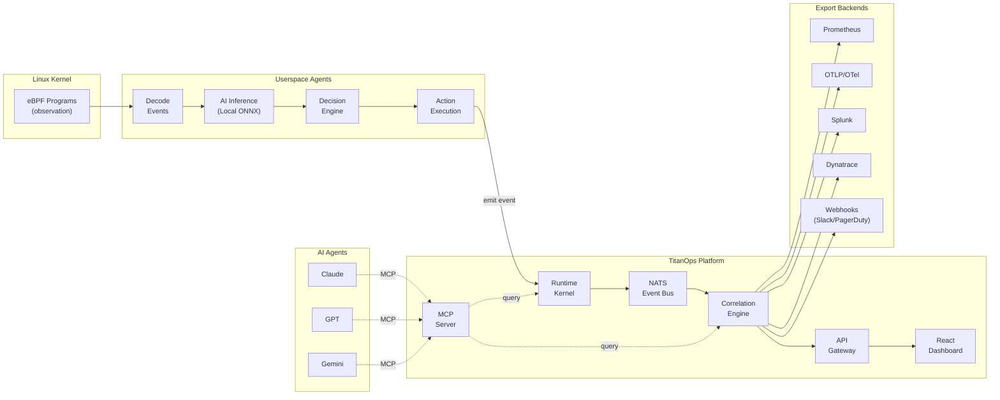

# TitanOps — Architecture Overview

> "Your observability stack tells you what's wrong. TitanOps fixes it."

**TitanOps** is an autonomous AiOps platform for Kubernetes. It doesn't replace your observability stack — it adds autonomous capabilities that plug into whatever tools you already use. eBPF observes the kernel. AI decides what to do. Actions execute at kernel speed.

---

## Platform At a Glance

```
┌──────────────────────────────────────────────────────────────────────────────────────────┐
│                              TITANOPS PLATFORM                                            │
│         Autonomous AiOps Modules for Kubernetes                                          │
│         Position: Observability tells you what's wrong. TitanOps fixes it.               │
│                                                                                          │
│   Core Pattern:  eBPF (kernel observation) → AI (analysis/decision) → Autonomous Action  │
│   Core Tech:     Go · Rust · TypeScript/React · eBPF · ONNX · Helm · NATS               │
│   Architecture:  Module/Kernel contract · Local-first AI · Cloud-optional · Vendor-neutral│
└──────────────────────────────────────────────────────────────────────────────────────────┘
```

---

## High-Level Architecture Diagram


```mermaid
graph TB
    %% === CORE PLATFORM (center) ===
    subgraph TITANOPS["🏛️ TITANOPS PLATFORM CORE"]
        direction TB
        
        subgraph CMD["cmd/titanops — Entry Point"]
            MAIN["main.go<br/>RuntimeKernel · Module lifecycle<br/>Correlation · Gateway"]
        end
        
        subgraph KERNEL["shared/titanops-platform — Module/Kernel Contract"]
            KRN["RuntimeKernel<br/>─────────────────────<br/>• Module.Start/Stop/HealthCheck<br/>• Panic isolation per module<br/>• Event routing + filtering<br/>• Shared services (K8s, AI, Config)<br/>• /api/modules/health endpoint<br/>─────────────────────<br/>Go · platform.Module interface"]
        end
        
        subgraph CORR["correlation/ — Correlation Engine"]
            CE["Cross-Module Signal Correlation<br/>─────────────────────<br/>• Time-windowed event matching<br/>• Confidence scoring<br/>• Incident narrative generation<br/>• Auto-action orchestration<br/>─────────────────────<br/>Go · NATS pub/sub · Protobuf events"]
        end
        
        subgraph GW["gateway/ — API Gateway"]
            GWS["REST API for Dashboard<br/>─────────────────────<br/>• /api/actions — Actions feed<br/>• /api/correlations — Timeline<br/>• /api/overrides — Human controls<br/>• /api/audit — Compliance trail<br/>• /api/explain — AI reasoning<br/>• /api/modules/health — Module status<br/>─────────────────────<br/>Go · net/http · JSON"]
        end
        
        subgraph MCPS["cmd/titanops-mcp — MCP Server"]
            MCP["AI Agent Interface (MCP)<br/>─────────────────────<br/>• get_module_health<br/>• get_recent_incidents<br/>• get_audit_trail<br/>• get_deployment_verdicts<br/>• search_events<br/>• explain_action<br/>─────────────────────<br/>Go · metoro-io/mcp-golang · stdio"]
        end
        
        subgraph DASH["dashboard/ — Command Center UI"]
            UI["Autonomous Operations Dashboard<br/>─────────────────────<br/>• Module health status<br/>• Cross-module correlation timeline<br/>• AI decision reasoning (explainability)<br/>• Human override controls<br/>• Audit trail for compliance<br/>─────────────────────<br/>TypeScript · React 18 · Vite 5"]
        end
    end

    %% === MODULES (surrounding) ===
    subgraph EARTHWORM["🪱 EARTHWORM — Health"]
        EW["K8s Cluster Heartbeat Monitoring<br/>─────────────────────<br/>• Node cardiogram via eBPF<br/>• Anomaly detection & prediction<br/>• Autonomous remediation<br/>• Rule-based + ML scoring<br/>─────────────────────<br/>Go · cilium/ebpf · ONNX<br/>implements platform.Module ✅"]
    end

    subgraph TLAPIX["🦡 TLAPIX — Security/Compliance"]
        TL["Autonomous TLS Certificate Guardian<br/>─────────────────────<br/>• Certificate lifecycle management<br/>• Shadow cert detection<br/>• Expiry prediction & auto-renewal<br/>• Anomaly scoring via ONNX<br/>─────────────────────<br/>Rust · Aya (eBPF) · ONNX Runtime<br/>Status: Helm ✅ · Prometheus ✅ · OTLP ✅"]
    end

    subgraph EBEECONTROL["🐝 eBeeControl — Threat Detection"]
        EB["Autonomous Deception Engine<br/>─────────────────────<br/>• Honeytoken deployment (K8s Secrets)<br/>• Tetragon gRPC event stream<br/>• AI threat classification<br/>• Auto pod isolation & IP blocking<br/>• Model publish guard<br/>─────────────────────<br/>Go · Tetragon · titanops-ai<br/>implements platform.Module ✅"]
    end

    subgraph QUACK["🦆 QUACK — Performance"]
        QK["AI-Powered Container CPU Scheduling<br/>─────────────────────<br/>• sched_ext kernel scheduler<br/>• Priority scoring via ML model<br/>• Latency-aware decisions<br/>• Autonomous CPU allocation<br/>─────────────────────<br/>Go · sched_ext · ONNX<br/>Status: Splunk ✅ (Helm planned)"]
    end

    subgraph OLLINAI["🔮 OllinAI — Change Intelligence"]
        OL["AI Deployment Verification<br/>─────────────────────<br/>• K8s deployment change detection<br/>• Change classification (6 types)<br/>• Pre/post telemetry comparison<br/>• Verdict: healthy/regression/inconclusive<br/>• DORA metrics & risk scoring<br/>─────────────────────<br/>Go · titanops-k8s · titanops-export<br/>Status: ✅ Active"]
    end

    %% === SHARED LIBRARIES ===
    subgraph SHARED["📦 SHARED LIBRARIES"]
        direction LR
        PLAT["titanops-platform<br/>───────<br/>Module interface<br/>Kernel interface<br/>RuntimeKernel<br/>Event routing<br/>Health aggregation"]
        AI["titanops-ai<br/>───────<br/>ONNX inference<br/>Pluggable cloud<br/>backends<br/>(Gemini, Bedrock,<br/>Vertex, SageMaker)"]
        K8S["titanops-k8s<br/>───────<br/>K8s client<br/>Secret reading<br/>Pod operations<br/>Common patterns"]
        EXP["titanops-export<br/>───────<br/>Prometheus metrics<br/>OTLP export<br/>Splunk HEC<br/>Dynatrace API<br/>Webhooks<br/>Ring buffer"]
        CFG["titanops-config<br/>───────<br/>Unified config<br/>loading<br/>Validation<br/>Hot reload"]
    end

    %% === INFRASTRUCTURE ===
    subgraph INFRA["🔧 INFRASTRUCTURE"]
        direction LR
        HELM["Umbrella Helm Chart<br/>───────<br/>One-command install<br/>Module toggles<br/>Shared RBAC<br/>Shared ConfigMap"]
        GRAF["Grafana Dashboards<br/>───────<br/>Overview · Certs<br/>Heartbeat · Deception<br/>Scheduling · Correlation"]
        NATS["NATS Event Bus<br/>───────<br/>In-cluster pub/sub<br/>~15MB RAM<br/>JetStream optional<br/>No external deps"]
    end

    %% === CONNECTIONS ===
    
    %% Kernel manages modules
    KRN -->|"lifecycle"| EW
    KRN -->|"lifecycle"| EB
    KRN -->|"lifecycle"| OL
    
    %% Modules feed events into correlation
    EW -->|"heartbeat events"| CE
    TL -->|"cert events"| CE
    EB -->|"threat events"| CE
    QK -->|"scheduling events"| CE
    OL -->|"verification verdicts"| CE
    
    %% Correlation flows to gateway/dashboard
    CE --> GWS
    GWS --> UI
    
    %% MCP server queries platform
    MCP -.->|"queries"| KRN
    MCP -.->|"queries"| CE
    
    %% Shared library usage
    PLAT -.->|"contract"| EW
    PLAT -.->|"contract"| EB
    PLAT -.->|"contract"| OL
    
    AI -.->|"inference"| EW
    AI -.->|"inference"| EB
    AI -.->|"inference"| QK
    AI -.->|"inference"| CE
    
    K8S -.->|"K8s ops"| EW
    K8S -.->|"K8s ops"| EB
    K8S -.->|"K8s ops"| OL
    K8S -.->|"K8s ops"| QK
    
    EXP -.->|"telemetry"| EW
    EXP -.->|"telemetry"| TL
    EXP -.->|"telemetry"| EB
    EXP -.->|"telemetry"| QK
    EXP -.->|"telemetry"| OL
    EXP -.->|"telemetry"| CE

    %% NATS as event transport
    NATS ---|"event transport"| CE

    %% Styling
    classDef platform fill:#1a1a2e,stroke:#16213e,color:#e0e0e0
    classDef module fill:#0f3460,stroke:#1a1a2e,color:#e0e0e0
    classDef shared fill:#533483,stroke:#1a1a2e,color:#e0e0e0
    classDef infra fill:#2c3e50,stroke:#1a1a2e,color:#e0e0e0
    
    class TITANOPS platform
    class EARTHWORM,TLAPIX,EBEECONTROL,QUACK,OLLINAI module
    class SHARED shared
    class INFRA infra
```

---

## Data Flow: From Kernel to Dashboard


```mermaid
flowchart LR
    subgraph KERNEL["Linux Kernel"]
        BPF["eBPF Programs<br/>(observation)"]
    end

    subgraph USERSPACE["Userspace Agents"]
        DECODE["Decode<br/>Events"]
        INFER["AI Inference<br/>(Local ONNX)"]
        DECIDE["Decision<br/>Engine"]
        ACT["Action<br/>Execution"]
    end

    subgraph PLATFORM["TitanOps Platform"]
        KERN["Runtime<br/>Kernel"]
        BUS["NATS<br/>Event Bus"]
        CORR2["Correlation<br/>Engine"]
        GW2["API<br/>Gateway"]
        DASH2["React<br/>Dashboard"]
        MCP2["MCP<br/>Server"]
    end

    subgraph EXPORT["Export Backends"]
        PROM["Prometheus"]
        OTLP["OTLP/OTel"]
        SPLK["Splunk"]
        DT["Dynatrace"]
        WH["Webhooks<br/>(Slack/PagerDuty)"]
    end

    subgraph AIAGENTS["AI Agents"]
        CLAUDE["Claude"]
        GPT["GPT"]
        GEMINI["Gemini"]
    end

    BPF --> DECODE --> INFER --> DECIDE --> ACT
    ACT -->|"emit event"| KERN
    KERN --> BUS
    BUS --> CORR2
    CORR2 --> GW2 --> DASH2
    CORR2 --> PROM
    CORR2 --> OTLP
    CORR2 --> SPLK
    CORR2 --> DT
    CORR2 --> WH
    MCP2 -.->|"query"| KERN
    MCP2 -.->|"query"| CORR2
    CLAUDE -.->|"MCP"| MCP2
    GPT -.->|"MCP"| MCP2
    GEMINI -.->|"MCP"| MCP2
```

---

## Module Summary Matrix

| Module | Domain | What It Does | Core Tech | eBPF Framework | AI Model | platform.Module | Status |
|--------|--------|-------------|-----------|----------------|----------|-----------------|--------|
| **Earthworm** 🪱 | Health | K8s heartbeat monitoring, anomaly detection & auto-remediation | Go | cilium/ebpf | ONNX (anomaly) | ✅ | Helm ✅, Prometheus ✅ |
| **Tlapix** 🦡 | Security | Autonomous TLS certificate lifecycle — detect, predict, renew | Rust | Aya | ONNX (anomaly) | — (Rust) | Helm ✅, Prometheus ✅, OTLP ✅ |
| **eBeeControl** 🐝 | Threat | Deception engine — honeytokens, threat classification, pod isolation | Go | Tetragon | titanops-ai | ✅ | Helm ✅, property tests ✅ |
| **Quack** 🦆 | Performance | AI-powered sched_ext CPU scheduling for containers | Go | sched_ext | ONNX (priority) | — (planned) | Splunk ✅ |
| **OllinAI** 🔮 | Change Intelligence | AI deployment verification, risk scoring, DORA metrics | Go | — | titanops-ai | — (planned) | ✅ Active, property tests ✅ |

---

## Shared Libraries (Go)

| Library | Responsibility | Consumers |
|---------|---------------|-----------|
| `titanops-platform` | Module/Kernel contract, RuntimeKernel, lifecycle management, event routing | All Go modules + cmd/titanops |
| `titanops-ai` | ONNX inference, pluggable cloud AI backends (Gemini, Bedrock, Vertex, SageMaker) | Earthworm, eBeeControl, Quack, Correlation |
| `titanops-k8s` | K8s client, secret reading, pod operations, common patterns | Earthworm, eBeeControl, OllinAI, Quack |
| `titanops-export` | Prometheus metrics, OTLP, Splunk HEC, Dynatrace API, webhooks, ring buffer | All modules + Correlation |
| `titanops-config` | Unified config loading, struct validation, hot reload | All modules + Correlation |

---

## Platform Components

| Component | Purpose | Tech |
|-----------|---------|------|
| `cmd/titanops` | Entry point — creates RuntimeKernel, registers modules, starts all | Go |
| `cmd/titanops-mcp` | MCP Server — exposes platform data to AI agents (Claude, GPT, Gemini) | Go, metoro-io/mcp-golang |
| `shared/titanops-platform` | Module/Kernel contract + RuntimeKernel implementation | Go |
| `correlation/` | Cross-module event correlation, confidence scoring, auto-actions | Go, NATS, Protobuf |
| `gateway/` | REST API serving decisions, actions, audit trail to the dashboard | Go, net/http |
| `dashboard/` | Autonomous operations command center (not a metrics dashboard) | React 18, TypeScript, Vite 5 |
| Umbrella Helm chart | One `helm install` for the full platform, modules toggleable | Helm 3, sub-charts |
| NATS event bus | In-cluster pub/sub for real-time module communication (~15MB RAM) | NATS (in Helm) |
| Grafana dashboards | Pre-built JSON dashboards for each module + correlation overview | Grafana JSON |

---

## Module/Kernel Contract

Every Go module implements `platform.Module`. The RuntimeKernel manages lifecycle with fault isolation:

```go
// Every module satisfies this contract:
type Module interface {
    ID() string
    Version() string
    Start(ctx context.Context, kernel Kernel) error
    Stop(ctx context.Context) error
    HealthCheck(ctx context.Context) HealthStatus
}

// The kernel provides shared services:
type Kernel interface {
    Emit(ctx context.Context, event export.Event) error
    Subscribe(filter EventFilter, handler EventHandler) Subscription
    K8sClient() k8s.Client
    AIProvider() ai.Provider
    ModuleConfig(moduleID string) json.RawMessage
    GetModule(id string) Module
    ClusterID() string
    Logger(moduleID string) Logger
}
```

**Guarantees:**
- A panicking module is caught and reported — never crashes the platform
- Modules start with 30s timeout, stop with 15s timeout
- Health checks run concurrently with 5s timeout
- Events are routed to subscribers with module/type/severity filtering

---

## AI Strategy: Local-First, Cloud-Optional

```
┌──────────────────────────────────────────────────────────┐
│                  TitanOps AI Layer                         │
│                                                           │
│        ┌──────────────────────────────────┐              │
│        │      AI Provider Interface        │              │
│        │  train() · predict() · explain()  │              │
│        └──────┬───────┬───────┬───────┬───┘              │
│               │       │       │       │                   │
│          ┌────┴──┐ ┌──┴───┐ ┌─┴────┐ ┌┴─────┐           │
│          │ Local │ │Gemini│ │Bedrock│ │Vertex│            │
│          │ ONNX  │ │      │ │      │ │      │            │
│          └───────┘ └──────┘ └──────┘ └──────┘            │
│                                                           │
│  Default: Local ONNX ($0, private, no internet needed)    │
│  Optional: Cloud for training & explanations              │
└──────────────────────────────────────────────────────────┘
```

| Tier | Backend | Cost | Use Case |
|------|---------|------|----------|
| 1 (default) | Local ONNX | $0 | Inference, decisions, actions — always works offline |
| 2 (optional) | Cloud ML (Bedrock, Vertex, SageMaker) | $$ | Model training at scale |
| 3 (optional) | LLM (Gemini, Claude, GPT) | $$$ | Natural language explanations, incident reports |

---

## MCP Server — AI Agent Integration

The TitanOps MCP Server (`cmd/titanops-mcp`) exposes platform data via the Model Context Protocol, allowing any AI agent to investigate your cluster:

| Tool | What It Provides |
|------|-----------------|
| `get_module_health` | Health status of all platform modules |
| `get_recent_incidents` | Correlated incidents with confidence scores |
| `get_audit_trail` | Autonomous decision history with rationale |
| `get_deployment_verdicts` | OllinAI deployment verification results |
| `search_events` | Query events by module/type/severity/namespace/time |
| `explain_action` | Full evidence trail for any autonomous action |

**Usage:** Single 4.6MB binary, stdio transport, zero config. Works with Claude Desktop, Kiro, or any MCP-capable client.

---

## Repository Structure

```
github.com/mercadoalex/titanops/
├── cmd/
│   ├── titanops/              Platform entry point (RuntimeKernel + modules)
│   └── titanops-mcp/          MCP Server for AI agent integration
├── correlation/               Cross-module correlation engine
├── gateway/                   REST API gateway
├── dashboard/                 React command center UI
├── modules/
│   ├── earthworm/             Heartbeat monitoring (platform.Module) ✅
│   ├── ebeecontrol/           Deception engine (platform.Module) ✅
│   └── ollinai/               Deployment verification ✅
├── shared/
│   ├── titanops-platform/     Module/Kernel contract + RuntimeKernel
│   ├── titanops-ai/           ONNX + pluggable cloud AI
│   ├── titanops-k8s/          Common K8s patterns
│   ├── titanops-export/       Multi-backend export
│   └── titanops-config/       Config loading & validation
├── helm/                      Umbrella Helm chart + module sub-charts
├── grafana/                   Pre-built dashboard JSON files
├── proto/                     Protobuf event schema definitions
├── infra/                     Terraform (EKS, VPC, IAM)
├── .github/workflows/ci.yml   CI: build + vet + test -race on every push
└── go.work                    Go workspace (13 modules)
```

---

## Language Strategy

**Go everywhere except Rust where eBPF demands it, TypeScript only for the dashboard.**

| Layer | Language | Rationale |
|-------|----------|-----------|
| Platform core + all modules | Go | Single binary, goroutines, client-go, shared libs |
| Tlapix eBPF probes | Rust | Aya requires Rust |
| Dashboard | TypeScript/React | Standard for frontend |

---

## Key Architectural Principles

1. **Pipeline-first**: All data flows as `eBPF Event → Decode → Infer → Decide → Act → Emit → Export`
2. **Module contract**: Every module implements `platform.Module`; the kernel manages lifecycle
3. **Fault isolation**: A panicking module is caught and reported, never propagated
4. **Lock-free hot path**: No mutexes between kernel event and action execution
5. **Zero-copy internally**: Pass struct pointers through pipeline, serialize only at boundaries
6. **Batch at boundaries**: Accumulate events, flush in batches to export backends
7. **Idempotent exports**: Every event has a UUID — backends can deduplicate safely
8. **Graceful degradation**: Cloud AI down → local ONNX → rule-based fallback
9. **Vendor-neutral**: Customer picks their observability backend — we export to all of them
10. **Go-first**: One language for the backend eliminates toolchain sprawl

---

## Business Model

| Tier | Includes | Price |
|------|----------|-------|
| **Open Source** | All 5 modules, Helm charts, Grafana dashboards, MCP Server | Free |
| **Pro** | Correlation engine, managed AI models, priority support | $/node/month |
| **Enterprise** | Custom integrations, SLA, dedicated support, training | Contact |

The open-source modules drive adoption. The correlation engine drives revenue.
